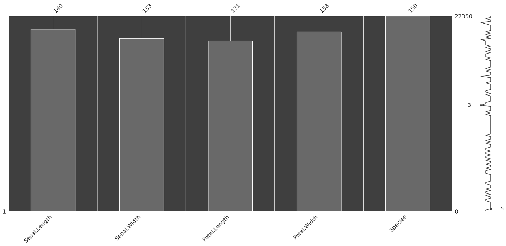
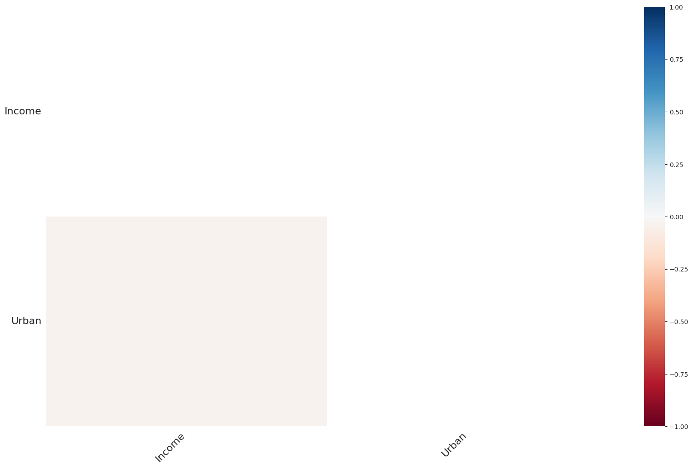
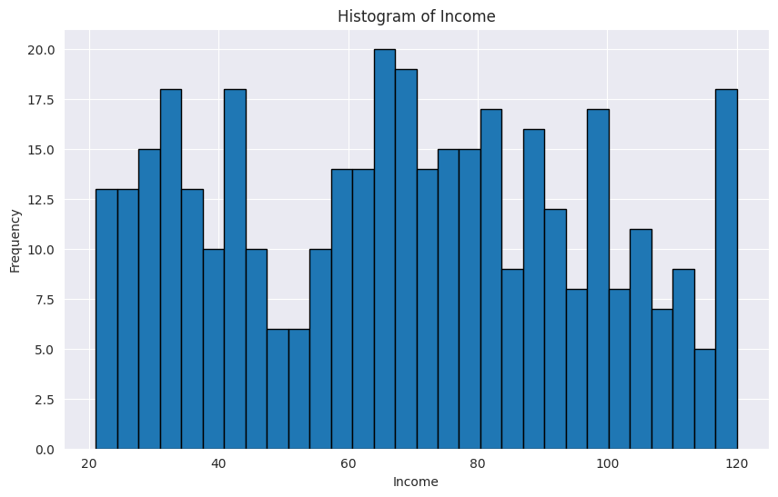
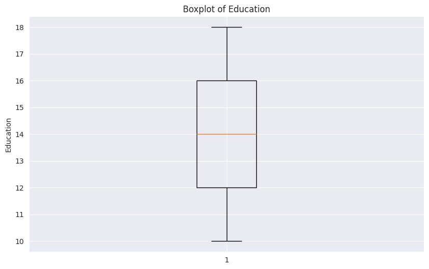
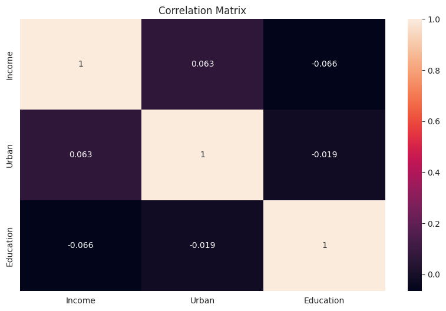

# Exercise 4. - Data Cleansing

## Handling Missing Values in Python


Real world data is messy and often contains a lot of missing values. 

There could be multiple reasons for the missing values but primarily the reason for missingness can be attributed to:

| Reason for missing Data | 
| :-----------: | 
| Data doesn't exist |
| Data not collected due to human error. | 
| Data deleted accidently |

## A guide to handling missing values 

Please read this tutorial on handling missing values first, before working on dirty data this week: [TUTORIAL](a_guide_to_na.ipynb).

# Dirty data


```python
import pandas as pd
import numpy as np
from pandas.core.common import random_state
from sklearn.ensemble import RandomForestClassifier
import warnings
import ssl
# Suppress warnings
warnings.filterwarnings('ignore')
# Disable SSL verification
ssl._create_default_https_context = ssl._create_unverified_context
import requests
from io import StringIO
```

Load the dataset from the provided URL using pandas.


```python
url = "https://raw.github.com/edwindj/datacleaning/master/data/dirty_iris.csv"
response = requests.get(url, verify=False)
data = StringIO(response.text)
dirty_iris = pd.read_csv(data, sep=",")
print(dirty_iris.head())
```

       Sepal.Length  Sepal.Width  Petal.Length  Petal.Width     Species
    0           6.4          3.2           4.5          1.5  versicolor
    1           6.3          3.3           6.0          2.5   virginica
    2           6.2          NaN           5.4          2.3   virginica
    3           5.0          3.4           1.6          0.4      setosa
    4           5.7          2.6           3.5          1.0  versicolor


```python
import missingno as msno
import matplotlib.pyplot as plt

msno.matrix(dirty_iris)
msno.bar(dirty_iris)
msno.heatmap(dirty_iris)
msno.dendrogram(dirty_iris)
```


    <Axes: >


    

    


    

    


    

    


## Introduce Missing Values

Randomly introduce missing values into the dataset to mimic the Python code behavior.


```python
# Load additional data
carseats = pd.read_csv("https://raw.githubusercontent.com/selva86/datasets/master/Carseats.csv")

# Set random seed for reproducibility
np.random.seed(123)

# Introduce missing values in 'Income' column
income_missing_indices = np.random.choice(carseats.index, size=20, replace=False)
carseats.loc[income_missing_indices, 'Income'] = np.nan

# Set another random seed for reproducibility
np.random.seed(456)

# Introduce missing values in 'Urban' column
urban_missing_indices = np.random.choice(carseats.index, size=10, replace=False)
carseats.loc[urban_missing_indices, 'Urban'] = np.nan
```

# Introduction

Analysis of data is a process of inspecting, cleaning, transforming, and modeling data with the goal of highlighting useful information, suggesting conclusions and supporting decision making.


Many times in the beginning we spend hours on handling problems with missing values, logical inconsistencies or outliers in our datasets. In this tutorial we will go through the most popular techniques in data cleansing.


We will be working with the messy dataset `iris`. Originally published at UCI Machine Learning Repository: Iris Data Set, this small dataset from 1936 is often used for testing out machine learning algorithms and visualizations. Each row of the table represents an iris flower, including its species and dimensions of its botanical parts, sepal and petal, in centimeters.

Take a look at this dataset here:


```python
dirty_iris
```


<div>
<style scoped>
    .dataframe tbody tr th:only-of-type {
        vertical-align: middle;
    }

    .dataframe tbody tr th {
        vertical-align: top;
    }

    .dataframe thead th {
        text-align: right;
    }
</style>
<table border="1" class="dataframe">
  <thead>
    <tr style="text-align: right;">
      <th></th>
      <th>Sepal.Length</th>
      <th>Sepal.Width</th>
      <th>Petal.Length</th>
      <th>Petal.Width</th>
      <th>Species</th>
    </tr>
  </thead>
  <tbody>
    <tr>
      <th>0</th>
      <td>6.4</td>
      <td>3.2</td>
      <td>4.500</td>
      <td>1.5</td>
      <td>versicolor</td>
    </tr>
    <tr>
      <th>1</th>
      <td>6.3</td>
      <td>3.3</td>
      <td>6.000</td>
      <td>2.5</td>
      <td>virginica</td>
    </tr>
    <tr>
      <th>2</th>
      <td>6.2</td>
      <td>NaN</td>
      <td>5.400</td>
      <td>2.3</td>
      <td>virginica</td>
    </tr>
    <tr>
      <th>3</th>
      <td>5.0</td>
      <td>3.4</td>
      <td>1.600</td>
      <td>0.4</td>
      <td>setosa</td>
    </tr>
    <tr>
      <th>4</th>
      <td>5.7</td>
      <td>2.6</td>
      <td>3.500</td>
      <td>1.0</td>
      <td>versicolor</td>
    </tr>
    <tr>
      <th>5</th>
      <td>5.3</td>
      <td>NaN</td>
      <td>NaN</td>
      <td>0.2</td>
      <td>setosa</td>
    </tr>
    <tr>
      <th>6</th>
      <td>6.4</td>
      <td>2.7</td>
      <td>5.300</td>
      <td>NaN</td>
      <td>virginica</td>
    </tr>
    <tr>
      <th>7</th>
      <td>5.9</td>
      <td>3.0</td>
      <td>5.100</td>
      <td>1.8</td>
      <td>virginica</td>
    </tr>
    <tr>
      <th>8</th>
      <td>5.8</td>
      <td>2.7</td>
      <td>4.100</td>
      <td>1.0</td>
      <td>versicolor</td>
    </tr>
    <tr>
      <th>9</th>
      <td>4.8</td>
      <td>3.1</td>
      <td>1.600</td>
      <td>0.2</td>
      <td>setosa</td>
    </tr>
    <tr>
      <th>10</th>
      <td>5.0</td>
      <td>3.5</td>
      <td>1.600</td>
      <td>0.6</td>
      <td>setosa</td>
    </tr>
    <tr>
      <th>11</th>
      <td>6.0</td>
      <td>2.7</td>
      <td>5.100</td>
      <td>1.6</td>
      <td>versicolor</td>
    </tr>
    <tr>
      <th>12</th>
      <td>6.0</td>
      <td>3.0</td>
      <td>4.800</td>
      <td>NaN</td>
      <td>virginica</td>
    </tr>
    <tr>
      <th>13</th>
      <td>6.8</td>
      <td>2.8</td>
      <td>4.800</td>
      <td>1.4</td>
      <td>versicolor</td>
    </tr>
    <tr>
      <th>14</th>
      <td>NaN</td>
      <td>3.9</td>
      <td>1.700</td>
      <td>0.4</td>
      <td>setosa</td>
    </tr>
    <tr>
      <th>15</th>
      <td>5.0</td>
      <td>-3.0</td>
      <td>3.500</td>
      <td>1.0</td>
      <td>versicolor</td>
    </tr>
    <tr>
      <th>16</th>
      <td>5.5</td>
      <td>NaN</td>
      <td>4.000</td>
      <td>1.3</td>
      <td>versicolor</td>
    </tr>
    <tr>
      <th>17</th>
      <td>4.7</td>
      <td>3.2</td>
      <td>1.300</td>
      <td>0.2</td>
      <td>setosa</td>
    </tr>
    <tr>
      <th>18</th>
      <td>NaN</td>
      <td>4.0</td>
      <td>NaN</td>
      <td>0.2</td>
      <td>setosa</td>
    </tr>
    <tr>
      <th>19</th>
      <td>5.6</td>
      <td>NaN</td>
      <td>4.200</td>
      <td>1.3</td>
      <td>versicolor</td>
    </tr>
    <tr>
      <th>20</th>
      <td>4.9</td>
      <td>3.6</td>
      <td>NaN</td>
      <td>0.1</td>
      <td>setosa</td>
    </tr>
    <tr>
      <th>21</th>
      <td>5.4</td>
      <td>NaN</td>
      <td>4.500</td>
      <td>1.5</td>
      <td>versicolor</td>
    </tr>
    <tr>
      <th>22</th>
      <td>6.2</td>
      <td>2.8</td>
      <td>NaN</td>
      <td>1.8</td>
      <td>virginica</td>
    </tr>
    <tr>
      <th>23</th>
      <td>6.7</td>
      <td>3.3</td>
      <td>5.700</td>
      <td>2.5</td>
      <td>virginica</td>
    </tr>
    <tr>
      <th>24</th>
      <td>NaN</td>
      <td>3.0</td>
      <td>5.900</td>
      <td>2.1</td>
      <td>virginica</td>
    </tr>
    <tr>
      <th>25</th>
      <td>4.6</td>
      <td>3.2</td>
      <td>1.400</td>
      <td>0.2</td>
      <td>setosa</td>
    </tr>
    <tr>
      <th>26</th>
      <td>4.9</td>
      <td>3.1</td>
      <td>1.500</td>
      <td>0.1</td>
      <td>setosa</td>
    </tr>
    <tr>
      <th>27</th>
      <td>73.0</td>
      <td>29.0</td>
      <td>63.000</td>
      <td>NaN</td>
      <td>virginica</td>
    </tr>
    <tr>
      <th>28</th>
      <td>6.5</td>
      <td>3.2</td>
      <td>5.100</td>
      <td>2.0</td>
      <td>virginica</td>
    </tr>
    <tr>
      <th>29</th>
      <td>NaN</td>
      <td>2.8</td>
      <td>0.820</td>
      <td>1.3</td>
      <td>versicolor</td>
    </tr>
    <tr>
      <th>30</th>
      <td>4.4</td>
      <td>3.2</td>
      <td>NaN</td>
      <td>0.2</td>
      <td>setosa</td>
    </tr>
    <tr>
      <th>31</th>
      <td>5.9</td>
      <td>3.2</td>
      <td>4.800</td>
      <td>NaN</td>
      <td>versicolor</td>
    </tr>
    <tr>
      <th>32</th>
      <td>5.7</td>
      <td>2.8</td>
      <td>4.500</td>
      <td>1.3</td>
      <td>versicolor</td>
    </tr>
    <tr>
      <th>33</th>
      <td>6.2</td>
      <td>2.9</td>
      <td>NaN</td>
      <td>1.3</td>
      <td>versicolor</td>
    </tr>
    <tr>
      <th>34</th>
      <td>6.6</td>
      <td>2.9</td>
      <td>23.000</td>
      <td>1.3</td>
      <td>versicolor</td>
    </tr>
    <tr>
      <th>35</th>
      <td>4.8</td>
      <td>3.0</td>
      <td>1.400</td>
      <td>0.1</td>
      <td>setosa</td>
    </tr>
    <tr>
      <th>36</th>
      <td>6.5</td>
      <td>3.0</td>
      <td>5.500</td>
      <td>1.8</td>
      <td>virginica</td>
    </tr>
    <tr>
      <th>37</th>
      <td>6.2</td>
      <td>2.2</td>
      <td>4.500</td>
      <td>1.5</td>
      <td>versicolor</td>
    </tr>
    <tr>
      <th>38</th>
      <td>6.7</td>
      <td>2.5</td>
      <td>5.800</td>
      <td>1.8</td>
      <td>virginica</td>
    </tr>
    <tr>
      <th>39</th>
      <td>5.0</td>
      <td>3.0</td>
      <td>1.600</td>
      <td>0.2</td>
      <td>setosa</td>
    </tr>
    <tr>
      <th>40</th>
      <td>5.0</td>
      <td>NaN</td>
      <td>1.200</td>
      <td>0.2</td>
      <td>setosa</td>
    </tr>
    <tr>
      <th>41</th>
      <td>5.8</td>
      <td>2.7</td>
      <td>3.900</td>
      <td>1.2</td>
      <td>versicolor</td>
    </tr>
    <tr>
      <th>42</th>
      <td>0.0</td>
      <td>NaN</td>
      <td>1.300</td>
      <td>0.4</td>
      <td>setosa</td>
    </tr>
    <tr>
      <th>43</th>
      <td>5.8</td>
      <td>2.7</td>
      <td>5.100</td>
      <td>1.9</td>
      <td>virginica</td>
    </tr>
    <tr>
      <th>44</th>
      <td>5.5</td>
      <td>4.2</td>
      <td>1.400</td>
      <td>0.2</td>
      <td>setosa</td>
    </tr>
    <tr>
      <th>45</th>
      <td>7.7</td>
      <td>2.8</td>
      <td>6.700</td>
      <td>2.0</td>
      <td>virginica</td>
    </tr>
    <tr>
      <th>46</th>
      <td>5.7</td>
      <td>NaN</td>
      <td>NaN</td>
      <td>0.4</td>
      <td>setosa</td>
    </tr>
    <tr>
      <th>47</th>
      <td>7.0</td>
      <td>3.2</td>
      <td>4.700</td>
      <td>1.4</td>
      <td>versicolor</td>
    </tr>
    <tr>
      <th>48</th>
      <td>6.5</td>
      <td>3.0</td>
      <td>5.800</td>
      <td>2.2</td>
      <td>virginica</td>
    </tr>
    <tr>
      <th>49</th>
      <td>6.0</td>
      <td>3.4</td>
      <td>4.500</td>
      <td>1.6</td>
      <td>versicolor</td>
    </tr>
    <tr>
      <th>50</th>
      <td>5.5</td>
      <td>2.6</td>
      <td>4.400</td>
      <td>1.2</td>
      <td>versicolor</td>
    </tr>
    <tr>
      <th>51</th>
      <td>4.9</td>
      <td>3.1</td>
      <td>NaN</td>
      <td>0.2</td>
      <td>setosa</td>
    </tr>
    <tr>
      <th>52</th>
      <td>5.2</td>
      <td>2.7</td>
      <td>3.900</td>
      <td>1.4</td>
      <td>versicolor</td>
    </tr>
    <tr>
      <th>53</th>
      <td>4.8</td>
      <td>3.4</td>
      <td>1.600</td>
      <td>0.2</td>
      <td>setosa</td>
    </tr>
    <tr>
      <th>54</th>
      <td>6.3</td>
      <td>3.3</td>
      <td>4.700</td>
      <td>1.6</td>
      <td>versicolor</td>
    </tr>
    <tr>
      <th>55</th>
      <td>7.7</td>
      <td>3.8</td>
      <td>6.700</td>
      <td>2.2</td>
      <td>virginica</td>
    </tr>
    <tr>
      <th>56</th>
      <td>5.1</td>
      <td>3.8</td>
      <td>1.500</td>
      <td>0.3</td>
      <td>setosa</td>
    </tr>
    <tr>
      <th>57</th>
      <td>NaN</td>
      <td>2.9</td>
      <td>4.500</td>
      <td>1.5</td>
      <td>versicolor</td>
    </tr>
    <tr>
      <th>58</th>
      <td>6.4</td>
      <td>2.8</td>
      <td>5.600</td>
      <td>NaN</td>
      <td>virginica</td>
    </tr>
    <tr>
      <th>59</th>
      <td>6.4</td>
      <td>2.8</td>
      <td>5.600</td>
      <td>2.1</td>
      <td>virginica</td>
    </tr>
    <tr>
      <th>60</th>
      <td>5.0</td>
      <td>2.3</td>
      <td>3.300</td>
      <td>NaN</td>
      <td>versicolor</td>
    </tr>
    <tr>
      <th>61</th>
      <td>7.4</td>
      <td>2.8</td>
      <td>6.100</td>
      <td>1.9</td>
      <td>virginica</td>
    </tr>
    <tr>
      <th>62</th>
      <td>4.3</td>
      <td>3.0</td>
      <td>1.100</td>
      <td>0.1</td>
      <td>setosa</td>
    </tr>
    <tr>
      <th>63</th>
      <td>5.0</td>
      <td>3.3</td>
      <td>1.400</td>
      <td>0.2</td>
      <td>setosa</td>
    </tr>
    <tr>
      <th>64</th>
      <td>7.2</td>
      <td>3.0</td>
      <td>5.800</td>
      <td>1.6</td>
      <td>virginica</td>
    </tr>
    <tr>
      <th>65</th>
      <td>6.3</td>
      <td>2.5</td>
      <td>4.900</td>
      <td>1.5</td>
      <td>versicolor</td>
    </tr>
    <tr>
      <th>66</th>
      <td>5.1</td>
      <td>2.5</td>
      <td>NaN</td>
      <td>1.1</td>
      <td>versicolor</td>
    </tr>
    <tr>
      <th>67</th>
      <td>NaN</td>
      <td>3.2</td>
      <td>5.700</td>
      <td>2.3</td>
      <td>virginica</td>
    </tr>
    <tr>
      <th>68</th>
      <td>5.1</td>
      <td>3.5</td>
      <td>NaN</td>
      <td>NaN</td>
      <td>setosa</td>
    </tr>
    <tr>
      <th>69</th>
      <td>5.0</td>
      <td>3.5</td>
      <td>1.300</td>
      <td>0.3</td>
      <td>setosa</td>
    </tr>
    <tr>
      <th>70</th>
      <td>6.1</td>
      <td>3.0</td>
      <td>4.600</td>
      <td>1.4</td>
      <td>versicolor</td>
    </tr>
    <tr>
      <th>71</th>
      <td>6.9</td>
      <td>3.1</td>
      <td>5.100</td>
      <td>2.3</td>
      <td>virginica</td>
    </tr>
    <tr>
      <th>72</th>
      <td>5.1</td>
      <td>3.5</td>
      <td>1.400</td>
      <td>0.3</td>
      <td>setosa</td>
    </tr>
    <tr>
      <th>73</th>
      <td>6.5</td>
      <td>NaN</td>
      <td>4.600</td>
      <td>1.5</td>
      <td>versicolor</td>
    </tr>
    <tr>
      <th>74</th>
      <td>5.6</td>
      <td>2.8</td>
      <td>4.900</td>
      <td>2.0</td>
      <td>virginica</td>
    </tr>
    <tr>
      <th>75</th>
      <td>4.9</td>
      <td>2.5</td>
      <td>4.500</td>
      <td>NaN</td>
      <td>virginica</td>
    </tr>
    <tr>
      <th>76</th>
      <td>5.5</td>
      <td>3.5</td>
      <td>1.300</td>
      <td>0.2</td>
      <td>setosa</td>
    </tr>
    <tr>
      <th>77</th>
      <td>7.6</td>
      <td>3.0</td>
      <td>6.600</td>
      <td>2.1</td>
      <td>virginica</td>
    </tr>
    <tr>
      <th>78</th>
      <td>5.1</td>
      <td>3.8</td>
      <td>0.000</td>
      <td>0.2</td>
      <td>setosa</td>
    </tr>
    <tr>
      <th>79</th>
      <td>7.9</td>
      <td>3.8</td>
      <td>6.400</td>
      <td>2.0</td>
      <td>virginica</td>
    </tr>
    <tr>
      <th>80</th>
      <td>6.1</td>
      <td>2.6</td>
      <td>5.600</td>
      <td>1.4</td>
      <td>virginica</td>
    </tr>
    <tr>
      <th>81</th>
      <td>5.4</td>
      <td>3.4</td>
      <td>1.700</td>
      <td>0.2</td>
      <td>setosa</td>
    </tr>
    <tr>
      <th>82</th>
      <td>6.1</td>
      <td>2.9</td>
      <td>4.700</td>
      <td>1.4</td>
      <td>versicolor</td>
    </tr>
    <tr>
      <th>83</th>
      <td>5.4</td>
      <td>3.7</td>
      <td>1.500</td>
      <td>0.2</td>
      <td>setosa</td>
    </tr>
    <tr>
      <th>84</th>
      <td>6.7</td>
      <td>3.0</td>
      <td>5.200</td>
      <td>2.3</td>
      <td>virginica</td>
    </tr>
    <tr>
      <th>85</th>
      <td>5.1</td>
      <td>3.8</td>
      <td>1.900</td>
      <td>inf</td>
      <td>setosa</td>
    </tr>
    <tr>
      <th>86</th>
      <td>6.4</td>
      <td>2.9</td>
      <td>4.300</td>
      <td>1.3</td>
      <td>versicolor</td>
    </tr>
    <tr>
      <th>87</th>
      <td>5.7</td>
      <td>2.9</td>
      <td>4.200</td>
      <td>1.3</td>
      <td>versicolor</td>
    </tr>
    <tr>
      <th>88</th>
      <td>4.4</td>
      <td>2.9</td>
      <td>1.400</td>
      <td>0.2</td>
      <td>setosa</td>
    </tr>
    <tr>
      <th>89</th>
      <td>6.3</td>
      <td>2.5</td>
      <td>5.000</td>
      <td>1.9</td>
      <td>virginica</td>
    </tr>
    <tr>
      <th>90</th>
      <td>7.2</td>
      <td>3.2</td>
      <td>6.000</td>
      <td>1.8</td>
      <td>virginica</td>
    </tr>
    <tr>
      <th>91</th>
      <td>4.9</td>
      <td>NaN</td>
      <td>3.300</td>
      <td>1.0</td>
      <td>versicolor</td>
    </tr>
    <tr>
      <th>92</th>
      <td>5.2</td>
      <td>3.4</td>
      <td>1.400</td>
      <td>0.2</td>
      <td>setosa</td>
    </tr>
    <tr>
      <th>93</th>
      <td>5.8</td>
      <td>2.7</td>
      <td>5.100</td>
      <td>1.9</td>
      <td>virginica</td>
    </tr>
    <tr>
      <th>94</th>
      <td>6.0</td>
      <td>2.2</td>
      <td>5.000</td>
      <td>1.5</td>
      <td>virginica</td>
    </tr>
    <tr>
      <th>95</th>
      <td>6.9</td>
      <td>3.1</td>
      <td>NaN</td>
      <td>1.5</td>
      <td>versicolor</td>
    </tr>
    <tr>
      <th>96</th>
      <td>5.5</td>
      <td>2.3</td>
      <td>4.000</td>
      <td>1.3</td>
      <td>versicolor</td>
    </tr>
    <tr>
      <th>97</th>
      <td>6.7</td>
      <td>NaN</td>
      <td>5.000</td>
      <td>1.7</td>
      <td>versicolor</td>
    </tr>
    <tr>
      <th>98</th>
      <td>5.7</td>
      <td>3.0</td>
      <td>4.200</td>
      <td>1.2</td>
      <td>versicolor</td>
    </tr>
    <tr>
      <th>99</th>
      <td>6.3</td>
      <td>2.8</td>
      <td>5.100</td>
      <td>1.5</td>
      <td>virginica</td>
    </tr>
    <tr>
      <th>100</th>
      <td>5.4</td>
      <td>3.4</td>
      <td>1.500</td>
      <td>0.4</td>
      <td>setosa</td>
    </tr>
    <tr>
      <th>101</th>
      <td>7.2</td>
      <td>3.6</td>
      <td>NaN</td>
      <td>2.5</td>
      <td>virginica</td>
    </tr>
    <tr>
      <th>102</th>
      <td>6.3</td>
      <td>2.7</td>
      <td>4.900</td>
      <td>NaN</td>
      <td>virginica</td>
    </tr>
    <tr>
      <th>103</th>
      <td>5.6</td>
      <td>3.0</td>
      <td>4.100</td>
      <td>1.3</td>
      <td>versicolor</td>
    </tr>
    <tr>
      <th>104</th>
      <td>5.1</td>
      <td>3.7</td>
      <td>NaN</td>
      <td>0.4</td>
      <td>setosa</td>
    </tr>
    <tr>
      <th>105</th>
      <td>5.5</td>
      <td>NaN</td>
      <td>0.925</td>
      <td>1.0</td>
      <td>versicolor</td>
    </tr>
    <tr>
      <th>106</th>
      <td>6.5</td>
      <td>3.0</td>
      <td>5.200</td>
      <td>2.0</td>
      <td>virginica</td>
    </tr>
    <tr>
      <th>107</th>
      <td>4.8</td>
      <td>3.0</td>
      <td>1.400</td>
      <td>NaN</td>
      <td>setosa</td>
    </tr>
    <tr>
      <th>108</th>
      <td>6.1</td>
      <td>2.8</td>
      <td>NaN</td>
      <td>1.3</td>
      <td>versicolor</td>
    </tr>
    <tr>
      <th>109</th>
      <td>4.6</td>
      <td>3.4</td>
      <td>1.400</td>
      <td>0.3</td>
      <td>setosa</td>
    </tr>
    <tr>
      <th>110</th>
      <td>6.3</td>
      <td>3.4</td>
      <td>NaN</td>
      <td>2.4</td>
      <td>virginica</td>
    </tr>
    <tr>
      <th>111</th>
      <td>5.0</td>
      <td>3.4</td>
      <td>1.500</td>
      <td>0.2</td>
      <td>setosa</td>
    </tr>
    <tr>
      <th>112</th>
      <td>5.1</td>
      <td>3.4</td>
      <td>1.500</td>
      <td>0.2</td>
      <td>setosa</td>
    </tr>
    <tr>
      <th>113</th>
      <td>NaN</td>
      <td>3.3</td>
      <td>5.700</td>
      <td>2.1</td>
      <td>virginica</td>
    </tr>
    <tr>
      <th>114</th>
      <td>6.7</td>
      <td>3.1</td>
      <td>4.700</td>
      <td>1.5</td>
      <td>versicolor</td>
    </tr>
    <tr>
      <th>115</th>
      <td>7.7</td>
      <td>2.6</td>
      <td>6.900</td>
      <td>2.3</td>
      <td>virginica</td>
    </tr>
    <tr>
      <th>116</th>
      <td>6.3</td>
      <td>NaN</td>
      <td>4.400</td>
      <td>1.3</td>
      <td>versicolor</td>
    </tr>
    <tr>
      <th>117</th>
      <td>4.6</td>
      <td>3.1</td>
      <td>1.500</td>
      <td>0.2</td>
      <td>setosa</td>
    </tr>
    <tr>
      <th>118</th>
      <td>NaN</td>
      <td>3.0</td>
      <td>5.500</td>
      <td>2.1</td>
      <td>virginica</td>
    </tr>
    <tr>
      <th>119</th>
      <td>NaN</td>
      <td>2.8</td>
      <td>4.700</td>
      <td>1.2</td>
      <td>versicolor</td>
    </tr>
    <tr>
      <th>120</th>
      <td>5.9</td>
      <td>3.0</td>
      <td>NaN</td>
      <td>1.5</td>
      <td>versicolor</td>
    </tr>
    <tr>
      <th>121</th>
      <td>4.5</td>
      <td>2.3</td>
      <td>1.300</td>
      <td>0.3</td>
      <td>setosa</td>
    </tr>
    <tr>
      <th>122</th>
      <td>6.4</td>
      <td>3.2</td>
      <td>5.300</td>
      <td>2.3</td>
      <td>virginica</td>
    </tr>
    <tr>
      <th>123</th>
      <td>5.2</td>
      <td>4.1</td>
      <td>1.500</td>
      <td>0.1</td>
      <td>setosa</td>
    </tr>
    <tr>
      <th>124</th>
      <td>49.0</td>
      <td>30.0</td>
      <td>14.000</td>
      <td>2.0</td>
      <td>setosa</td>
    </tr>
    <tr>
      <th>125</th>
      <td>5.6</td>
      <td>2.9</td>
      <td>3.600</td>
      <td>1.3</td>
      <td>versicolor</td>
    </tr>
    <tr>
      <th>126</th>
      <td>6.8</td>
      <td>3.2</td>
      <td>5.900</td>
      <td>2.3</td>
      <td>virginica</td>
    </tr>
    <tr>
      <th>127</th>
      <td>5.8</td>
      <td>NaN</td>
      <td>5.100</td>
      <td>2.4</td>
      <td>virginica</td>
    </tr>
    <tr>
      <th>128</th>
      <td>4.6</td>
      <td>3.6</td>
      <td>NaN</td>
      <td>0.2</td>
      <td>setosa</td>
    </tr>
    <tr>
      <th>129</th>
      <td>5.7</td>
      <td>0.0</td>
      <td>1.700</td>
      <td>0.3</td>
      <td>setosa</td>
    </tr>
    <tr>
      <th>130</th>
      <td>5.6</td>
      <td>2.5</td>
      <td>3.900</td>
      <td>1.1</td>
      <td>versicolor</td>
    </tr>
    <tr>
      <th>131</th>
      <td>6.7</td>
      <td>3.1</td>
      <td>4.400</td>
      <td>1.4</td>
      <td>versicolor</td>
    </tr>
    <tr>
      <th>132</th>
      <td>4.8</td>
      <td>NaN</td>
      <td>1.900</td>
      <td>0.2</td>
      <td>setosa</td>
    </tr>
    <tr>
      <th>133</th>
      <td>5.1</td>
      <td>3.3</td>
      <td>1.700</td>
      <td>0.5</td>
      <td>setosa</td>
    </tr>
    <tr>
      <th>134</th>
      <td>4.4</td>
      <td>3.0</td>
      <td>1.300</td>
      <td>NaN</td>
      <td>setosa</td>
    </tr>
    <tr>
      <th>135</th>
      <td>7.7</td>
      <td>3.0</td>
      <td>NaN</td>
      <td>2.3</td>
      <td>virginica</td>
    </tr>
    <tr>
      <th>136</th>
      <td>4.7</td>
      <td>3.2</td>
      <td>1.600</td>
      <td>0.2</td>
      <td>setosa</td>
    </tr>
    <tr>
      <th>137</th>
      <td>NaN</td>
      <td>3.0</td>
      <td>4.900</td>
      <td>1.8</td>
      <td>virginica</td>
    </tr>
    <tr>
      <th>138</th>
      <td>6.9</td>
      <td>3.1</td>
      <td>5.400</td>
      <td>2.1</td>
      <td>virginica</td>
    </tr>
    <tr>
      <th>139</th>
      <td>6.0</td>
      <td>2.2</td>
      <td>4.000</td>
      <td>1.0</td>
      <td>versicolor</td>
    </tr>
    <tr>
      <th>140</th>
      <td>5.0</td>
      <td>NaN</td>
      <td>1.400</td>
      <td>0.2</td>
      <td>setosa</td>
    </tr>
    <tr>
      <th>141</th>
      <td>5.5</td>
      <td>NaN</td>
      <td>3.800</td>
      <td>1.1</td>
      <td>versicolor</td>
    </tr>
    <tr>
      <th>142</th>
      <td>6.6</td>
      <td>3.0</td>
      <td>4.400</td>
      <td>1.4</td>
      <td>versicolor</td>
    </tr>
    <tr>
      <th>143</th>
      <td>6.3</td>
      <td>2.9</td>
      <td>5.600</td>
      <td>1.8</td>
      <td>virginica</td>
    </tr>
    <tr>
      <th>144</th>
      <td>5.7</td>
      <td>2.5</td>
      <td>5.000</td>
      <td>2.0</td>
      <td>virginica</td>
    </tr>
    <tr>
      <th>145</th>
      <td>6.7</td>
      <td>3.1</td>
      <td>5.600</td>
      <td>2.4</td>
      <td>virginica</td>
    </tr>
    <tr>
      <th>146</th>
      <td>5.6</td>
      <td>3.0</td>
      <td>4.500</td>
      <td>1.5</td>
      <td>versicolor</td>
    </tr>
    <tr>
      <th>147</th>
      <td>5.2</td>
      <td>3.5</td>
      <td>1.500</td>
      <td>0.2</td>
      <td>setosa</td>
    </tr>
    <tr>
      <th>148</th>
      <td>6.4</td>
      <td>3.1</td>
      <td>NaN</td>
      <td>1.8</td>
      <td>virginica</td>
    </tr>
    <tr>
      <th>149</th>
      <td>5.8</td>
      <td>2.6</td>
      <td>4.000</td>
      <td>NaN</td>
      <td>versicolor</td>
    </tr>
  </tbody>
</table>
</div>


## Detecting NA

A missing value, represented by NaN in Python, is a placeholder for a datum of which the type is known but its value isn't. Therefore, it is impossible to perform statistical analysis on data where one or more values in the data are missing. One may choose to either omit elements from a dataset that contain missing values or to impute a value, but missingness is something to be dealt with prior to any analysis.


Can you see that many values in our dataset have status NaN = Not Available? Count (or plot), how many (%) of all 150 rows is complete.


```python
# Count the number of complete cases (rows without any missing values)
complete_cases = dirty_iris.dropna().shape[0]

# Calculate the percentage of complete cases
percentage_complete = (complete_cases / dirty_iris.shape[0]) * 100

print(f"Number of complete cases: {complete_cases}")
print(f"Percentage of complete cases: {percentage_complete:.2f}%")
```

    Number of complete cases: 96
    Percentage of complete cases: 64.00%


Does the data contain other special values? If it does, replace them with NA.


```python
# Define a function to check for special values
def is_special(x):
    if np.issubdtype(x.dtype, np.number):
        return ~np.isfinite(x)
    else:
        return pd.isna(x)

# Apply the function to each column and replace special values with NaN
for col in dirty_iris.columns:
    dirty_iris[col] = dirty_iris[col].apply(lambda x: np.nan if is_special(pd.Series([x]))[0] else x)

# Display summary of the data
print(dirty_iris.describe(include='all'))
```

            Sepal.Length  Sepal.Width  Petal.Length  Petal.Width     Species
    count     140.000000   133.000000    131.000000   137.000000         150
    unique           NaN          NaN           NaN          NaN           3
    top              NaN          NaN           NaN          NaN  versicolor
    freq             NaN          NaN           NaN          NaN          50
    mean        6.559286     3.390977      4.449962     1.207299         NaN
    std         6.800940     3.315310      5.769299     0.764722         NaN
    min         0.000000    -3.000000      0.000000     0.100000         NaN
    25%         5.100000     2.800000      1.600000     0.300000         NaN
    50%         5.750000     3.000000      4.500000     1.300000         NaN
    75%         6.400000     3.300000      5.100000     1.800000         NaN
    max        73.000000    30.000000     63.000000     2.500000         NaN


## Checking consistency

Consistent data are technically correct data that are fit for statistical analysis. They are data in which missing values, special values, (obvious) errors and outliers are either removed, corrected or imputed. The data are consistent with constraints based on real-world knowledge about the subject that the data describe.


We have the following background knowledge:

-   Species should be one of the following values: setosa, versicolor or virginica.

-   All measured numerical properties of an iris should be positive.

-   The petal length of an iris is at least 2 times its petal width.

-   The sepal length of an iris cannot exceed 30 cm.

-   The sepals of an iris are longer than its petals.

Define these rules in a separate object 'RULES' and read them into Python. Print the resulting constraint object.


```python
# Define the rules as functions
def check_rules(df):
    rules = {
        "Sepal.Length <= 30": df["Sepal.Length"] <= 30,
        "Species in ['setosa', 'versicolor', 'virginica']": df["Species"].isin(['setosa', 'versicolor', 'virginica']),
        "Sepal.Length > 0": df["Sepal.Length"] > 0,
        "Sepal.Width > 0": df["Sepal.Width"] > 0,
        "Petal.Length > 0": df["Petal.Length"] > 0,
        "Petal.Width > 0": df["Petal.Width"] > 0,
        "Petal.Length >= 2 * Petal.Width": df["Petal.Length"] >= 2 * df["Petal.Width"],
        "Sepal.Length > Petal.Length": df["Sepal.Length"] > df["Petal.Length"]
    }
    return rules

# Apply the rules to the dataframe
rules = check_rules(dirty_iris)

# Print the rules
for rule, result in rules.items():
    print(f"{rule}: {result.all()}")
```

    Sepal.Length <= 30: False
    Species in ['setosa', 'versicolor', 'virginica']: True
    Sepal.Length > 0: False
    Sepal.Width > 0: False
    Petal.Length > 0: False
    Petal.Width > 0: False
    Petal.Length >= 2 * Petal.Width: False
    Sepal.Length > Petal.Length: False


Now we are ready to determine how often each rule is broken (violations). Also we can summarize and plot the result.


```python
# Check for rule violations
violations = {rule: ~result for rule, result in rules.items()}

# Summarize the violations
summary = {rule: result.sum() for rule, result in violations.items()}

# Print the summary of violations
print("Summary of Violations:")
for rule, count in summary.items():
    print(f"{rule}: {count} violations")
```

    Summary of Violations:
    Sepal.Length <= 30: 12 violations
    Species in ['setosa', 'versicolor', 'virginica']: 0 violations
    Sepal.Length > 0: 11 violations
    Sepal.Width > 0: 19 violations
    Petal.Length > 0: 20 violations
    Petal.Width > 0: 13 violations
    Petal.Length >= 2 * Petal.Width: 34 violations
    Sepal.Length > Petal.Length: 30 violations


What percentage of the data has no errors?


```python
import matplotlib.pyplot as plt
# Plot the violations
violation_counts = pd.Series(summary)
ax = violation_counts.plot(kind='bar', figsize=(10, 6))
plt.title('Summary of Rule Violations')
plt.xlabel('Rules')
plt.ylabel('Number of Violations')

# Add percentage labels above the bars
for p in ax.patches:
    ax.annotate(f'{p.get_height() / len(dirty_iris) * 100:.1f}%', 
                (p.get_x() + p.get_width() / 2., p.get_height()), 
                ha='center', va='center', xytext=(0, 10), 
                textcoords='offset points')

plt.show()
```


    

    


Find out which observations have too long sepals using the result of violations.


```python
# Check for rule violations
violations = {rule: ~result for rule, result in rules.items()}
# Combine violations into a DataFrame
violated_df = pd.DataFrame(violations)
violated_rows = dirty_iris[violated_df["Sepal.Length <= 30"]]
print(violated_rows)
```

         Sepal.Length  Sepal.Width  Petal.Length  Petal.Width     Species
    14            NaN          3.9          1.70          0.4      setosa
    18            NaN          4.0           NaN          0.2      setosa
    24            NaN          3.0          5.90          2.1   virginica
    27           73.0         29.0         63.00          NaN   virginica
    29            NaN          2.8          0.82          1.3  versicolor
    57            NaN          2.9          4.50          1.5  versicolor
    67            NaN          3.2          5.70          2.3   virginica
    113           NaN          3.3          5.70          2.1   virginica
    118           NaN          3.0          5.50          2.1   virginica
    119           NaN          2.8          4.70          1.2  versicolor
    124          49.0         30.0         14.00          2.0      setosa
    137           NaN          3.0          4.90          1.8   virginica


Find outliers in sepal length using boxplot approach. Retrieve the corresponding observations and look at the other values. Any ideas what might have happened? Set the outliers to NA (or a value that you find more appropiate)


```python
# Boxplot for Sepal.Length
plt.figure(figsize=(10, 6))
plt.boxplot(dirty_iris['Sepal.Length'].dropna())
plt.title('Boxplot of Sepal Length')
plt.ylabel('Sepal Length')
plt.show()
```


    

    


```python
# Find outliers in Sepal.Length
outliers = dirty_iris['Sepal.Length'][np.abs(dirty_iris['Sepal.Length'] - dirty_iris['Sepal.Length'].mean()) > (1.5 * dirty_iris['Sepal.Length'].std())]
outliers_idx = dirty_iris.index[dirty_iris['Sepal.Length'].isin(outliers)]

# Print the rows with outliers
print("Outliers:")
print(dirty_iris.loc[outliers_idx])
```

    Outliers:
         Sepal.Length  Sepal.Width  Petal.Length  Petal.Width    Species
    27           73.0         29.0          63.0          NaN  virginica
    124          49.0         30.0          14.0          2.0     setosa


They all seem to be too big... may they were measured in mm i.o cm?


```python
# Adjust the outliers (assuming they were measured in mm instead of cm)
dirty_iris.loc[outliers_idx, ['Sepal.Length', 'Sepal.Width', 'Petal.Length', 'Petal.Width']] /= 10

# Summary of the adjusted data
print("Summary of adjusted data:")
print(dirty_iris.describe())
```

    Summary of adjusted data:
           Sepal.Length  Sepal.Width  Petal.Length  Petal.Width
    count    140.000000   133.000000    131.000000   137.000000
    mean       5.775000     2.991729      3.920954     1.194161
    std        0.969842     0.708075      2.455417     0.766463
    min        0.000000    -3.000000      0.000000     0.100000
    25%        5.100000     2.800000      1.600000     0.300000
    50%        5.700000     3.000000      4.400000     1.300000
    75%        6.400000     3.300000      5.100000     1.800000
    max        7.900000     4.200000     23.000000     2.500000


Note that simple boxplot shows an extra outlier!


```python
import seaborn as sns
plt.figure(figsize=(10, 6))
sns.boxplot(x='Species', y='Sepal.Length', data=dirty_iris)
plt.title('Boxplot of Sepal Length by Species')
plt.xlabel('Species')
plt.ylabel('Sepal Length')
plt.show()
```


    

    


## Correcting

Replace non positive values from Sepal.Width with NA:


```python
# Define the correction rule
def correct_sepal_width(df):
    df.loc[(~df['Sepal.Width'].isna()) & (df['Sepal.Width'] <= 0), 'Sepal.Width'] = np.nan
    return df

# Apply the correction rule to the dataframe
mydata_corrected = correct_sepal_width(dirty_iris)

# Print the corrected dataframe
print(mydata_corrected)
```

         Sepal.Length  Sepal.Width  Petal.Length  Petal.Width     Species
    0             6.4          3.2         4.500          1.5  versicolor
    1             6.3          3.3         6.000          2.5   virginica
    2             6.2          NaN         5.400          2.3   virginica
    3             5.0          3.4         1.600          0.4      setosa
    4             5.7          2.6         3.500          1.0  versicolor
    5             5.3          NaN           NaN          0.2      setosa
    6             6.4          2.7         5.300          NaN   virginica
    7             5.9          3.0         5.100          1.8   virginica
    8             5.8          2.7         4.100          1.0  versicolor
    9             4.8          3.1         1.600          0.2      setosa
    10            5.0          3.5         1.600          0.6      setosa
    11            6.0          2.7         5.100          1.6  versicolor
    12            6.0          3.0         4.800          NaN   virginica
    13            6.8          2.8         4.800          1.4  versicolor
    14            NaN          3.9         1.700          0.4      setosa
    15            5.0          NaN         3.500          1.0  versicolor
    16            5.5          NaN         4.000          1.3  versicolor
    17            4.7          3.2         1.300          0.2      setosa
    18            NaN          4.0           NaN          0.2      setosa
    19            5.6          NaN         4.200          1.3  versicolor
    20            4.9          3.6           NaN          0.1      setosa
    21            5.4          NaN         4.500          1.5  versicolor
    22            6.2          2.8           NaN          1.8   virginica
    23            6.7          3.3         5.700          2.5   virginica
    24            NaN          3.0         5.900          2.1   virginica
    25            4.6          3.2         1.400          0.2      setosa
    26            4.9          3.1         1.500          0.1      setosa
    27            7.3          2.9         6.300          NaN   virginica
    28            6.5          3.2         5.100          2.0   virginica
    29            NaN          2.8         0.820          1.3  versicolor
    30            4.4          3.2           NaN          0.2      setosa
    31            5.9          3.2         4.800          NaN  versicolor
    32            5.7          2.8         4.500          1.3  versicolor
    33            6.2          2.9           NaN          1.3  versicolor
    34            6.6          2.9        23.000          1.3  versicolor
    35            4.8          3.0         1.400          0.1      setosa
    36            6.5          3.0         5.500          1.8   virginica
    37            6.2          2.2         4.500          1.5  versicolor
    38            6.7          2.5         5.800          1.8   virginica
    39            5.0          3.0         1.600          0.2      setosa
    40            5.0          NaN         1.200          0.2      setosa
    41            5.8          2.7         3.900          1.2  versicolor
    42            0.0          NaN         1.300          0.4      setosa
    43            5.8          2.7         5.100          1.9   virginica
    44            5.5          4.2         1.400          0.2      setosa
    45            7.7          2.8         6.700          2.0   virginica
    46            5.7          NaN           NaN          0.4      setosa
    47            7.0          3.2         4.700          1.4  versicolor
    48            6.5          3.0         5.800          2.2   virginica
    49            6.0          3.4         4.500          1.6  versicolor
    50            5.5          2.6         4.400          1.2  versicolor
    51            4.9          3.1           NaN          0.2      setosa
    52            5.2          2.7         3.900          1.4  versicolor
    53            4.8          3.4         1.600          0.2      setosa
    54            6.3          3.3         4.700          1.6  versicolor
    55            7.7          3.8         6.700          2.2   virginica
    56            5.1          3.8         1.500          0.3      setosa
    57            NaN          2.9         4.500          1.5  versicolor
    58            6.4          2.8         5.600          NaN   virginica
    59            6.4          2.8         5.600          2.1   virginica
    60            5.0          2.3         3.300          NaN  versicolor
    61            7.4          2.8         6.100          1.9   virginica
    62            4.3          3.0         1.100          0.1      setosa
    63            5.0          3.3         1.400          0.2      setosa
    64            7.2          3.0         5.800          1.6   virginica
    65            6.3          2.5         4.900          1.5  versicolor
    66            5.1          2.5           NaN          1.1  versicolor
    67            NaN          3.2         5.700          2.3   virginica
    68            5.1          3.5           NaN          NaN      setosa
    69            5.0          3.5         1.300          0.3      setosa
    70            6.1          3.0         4.600          1.4  versicolor
    71            6.9          3.1         5.100          2.3   virginica
    72            5.1          3.5         1.400          0.3      setosa
    73            6.5          NaN         4.600          1.5  versicolor
    74            5.6          2.8         4.900          2.0   virginica
    75            4.9          2.5         4.500          NaN   virginica
    76            5.5          3.5         1.300          0.2      setosa
    77            7.6          3.0         6.600          2.1   virginica
    78            5.1          3.8         0.000          0.2      setosa
    79            7.9          3.8         6.400          2.0   virginica
    80            6.1          2.6         5.600          1.4   virginica
    81            5.4          3.4         1.700          0.2      setosa
    82            6.1          2.9         4.700          1.4  versicolor
    83            5.4          3.7         1.500          0.2      setosa
    84            6.7          3.0         5.200          2.3   virginica
    85            5.1          3.8         1.900          NaN      setosa
    86            6.4          2.9         4.300          1.3  versicolor
    87            5.7          2.9         4.200          1.3  versicolor
    88            4.4          2.9         1.400          0.2      setosa
    89            6.3          2.5         5.000          1.9   virginica
    90            7.2          3.2         6.000          1.8   virginica
    91            4.9          NaN         3.300          1.0  versicolor
    92            5.2          3.4         1.400          0.2      setosa
    93            5.8          2.7         5.100          1.9   virginica
    94            6.0          2.2         5.000          1.5   virginica
    95            6.9          3.1           NaN          1.5  versicolor
    96            5.5          2.3         4.000          1.3  versicolor
    97            6.7          NaN         5.000          1.7  versicolor
    98            5.7          3.0         4.200          1.2  versicolor
    99            6.3          2.8         5.100          1.5   virginica
    100           5.4          3.4         1.500          0.4      setosa
    101           7.2          3.6           NaN          2.5   virginica
    102           6.3          2.7         4.900          NaN   virginica
    103           5.6          3.0         4.100          1.3  versicolor
    104           5.1          3.7           NaN          0.4      setosa
    105           5.5          NaN         0.925          1.0  versicolor
    106           6.5          3.0         5.200          2.0   virginica
    107           4.8          3.0         1.400          NaN      setosa
    108           6.1          2.8           NaN          1.3  versicolor
    109           4.6          3.4         1.400          0.3      setosa
    110           6.3          3.4           NaN          2.4   virginica
    111           5.0          3.4         1.500          0.2      setosa
    112           5.1          3.4         1.500          0.2      setosa
    113           NaN          3.3         5.700          2.1   virginica
    114           6.7          3.1         4.700          1.5  versicolor
    115           7.7          2.6         6.900          2.3   virginica
    116           6.3          NaN         4.400          1.3  versicolor
    117           4.6          3.1         1.500          0.2      setosa
    118           NaN          3.0         5.500          2.1   virginica
    119           NaN          2.8         4.700          1.2  versicolor
    120           5.9          3.0           NaN          1.5  versicolor
    121           4.5          2.3         1.300          0.3      setosa
    122           6.4          3.2         5.300          2.3   virginica
    123           5.2          4.1         1.500          0.1      setosa
    124           4.9          3.0         1.400          0.2      setosa
    125           5.6          2.9         3.600          1.3  versicolor
    126           6.8          3.2         5.900          2.3   virginica
    127           5.8          NaN         5.100          2.4   virginica
    128           4.6          3.6           NaN          0.2      setosa
    129           5.7          NaN         1.700          0.3      setosa
    130           5.6          2.5         3.900          1.1  versicolor
    131           6.7          3.1         4.400          1.4  versicolor
    132           4.8          NaN         1.900          0.2      setosa
    133           5.1          3.3         1.700          0.5      setosa
    134           4.4          3.0         1.300          NaN      setosa
    135           7.7          3.0           NaN          2.3   virginica
    136           4.7          3.2         1.600          0.2      setosa
    137           NaN          3.0         4.900          1.8   virginica
    138           6.9          3.1         5.400          2.1   virginica
    139           6.0          2.2         4.000          1.0  versicolor
    140           5.0          NaN         1.400          0.2      setosa
    141           5.5          NaN         3.800          1.1  versicolor
    142           6.6          3.0         4.400          1.4  versicolor
    143           6.3          2.9         5.600          1.8   virginica
    144           5.7          2.5         5.000          2.0   virginica
    145           6.7          3.1         5.600          2.4   virginica
    146           5.6          3.0         4.500          1.5  versicolor
    147           5.2          3.5         1.500          0.2      setosa
    148           6.4          3.1           NaN          1.8   virginica
    149           5.8          2.6         4.000          NaN  versicolor


Replace all erroneous values with NA using (the result of) localizeErrors:


```python
# Apply the rules to the dataframe
rules = check_rules(dirty_iris)
violations = {rule: ~result for rule, result in rules.items()}
violated_df = pd.DataFrame(violations)

# Localize errors and set them to NA
for col in violated_df.columns:
    dirty_iris.loc[violated_df[col], col.split()[0]] = np.nan
```

## Imputing NA's

Imputation is the process of estimating or deriving values for fields where data is missing. There is a vast body of literature on imputation methods and it goes beyond the scope of this tutorial to discuss all of them.

There is no one single best imputation method that works in all cases. The imputation model of choice depends on what auxiliary information is available and whether there are (multivariate) edit restrictions on the data to be imputed. The availability of R software for imputation under edit restrictions is, to our best knowledge, limited. However, a viable strategy for imputing numerical data is to first impute missing values without restrictions, and then minimally adjust the imputed values so that the restrictions are obeyed. Separately, these methods are available in R.

We can mention several approaches to imputation:

1.  For the **quantitative** variables:

-   imputing by **mean**/**median**/**mode**

-   **KNN** -- K-nearest-neighbors approach

-   **RPART** -- random forests multivariate approach

-   **mice** - Multivariate Imputation by Chained Equations approach

2.  For the **qualitative** variables:

-   imputing by **mode**

-   **RPART** -- random forests multivariate approach

-   **mice** - Multivariate Imputation by Chained Equations approach

    ... and many others. Please read the theoretical background if you are interested in those techniques.


***Exercise 1.*** Use ***kNN*** imputation ('sklearn' package) to impute all missing values. The KNNImputer from sklearn requires all data to be numeric. Since our dataset contains categorical data (e.g., the Species column), you need to handle these columns separately. One approach is to use one-hot encoding for categorical variables before applying the imputer.


```python
from sklearn.impute import KNNImputer
from sklearn.preprocessing import OneHotEncoder
# Replace infinite values with NaN
dirty_iris.replace([np.inf, -np.inf], np.nan, inplace=True)

# Separate numeric and categorical columns
numeric_cols = dirty_iris.select_dtypes(include=[np.number]).columns
categorical_cols = dirty_iris.select_dtypes(exclude=[np.number]).columns

# One-hot encode categorical columns
encoder = OneHotEncoder(sparse_output=False, handle_unknown='ignore')

encoded_categorical = pd.DataFrame(encoder.fit_transform(dirty_iris[categorical_cols]), columns=encoder.get_feature_names_out(categorical_cols))

# Combine numeric and encoded categorical columns
combined_data = pd.concat([dirty_iris[numeric_cols], encoded_categorical], axis=1)

# Initialize the KNNImputer
imputer = KNNImputer(n_neighbors=3)

# Perform kNN imputation
imputed_data = imputer.fit_transform(combined_data)

# Convert the imputed data back to a DataFrame
imputed_df = pd.DataFrame(imputed_data, columns=combined_data.columns)

# Decode the one-hot encoded columns back to original categorical columns
decoded_categorical = pd.DataFrame(encoder.inverse_transform(imputed_df[encoded_categorical.columns]), columns=categorical_cols)

# Combine numeric and decoded categorical columns
final_imputed_data = pd.concat([imputed_df[numeric_cols], decoded_categorical], axis=1)

# Print the imputed data
print(final_imputed_data)
```

         Sepal.Length  Sepal.Width  Petal.Length  Petal.Width     Species
    0        6.400000     3.200000      4.500000     1.500000  versicolor
    1        6.300000     3.300000      6.000000     2.500000   virginica
    2        6.200000     3.033333      5.400000     2.300000   virginica
    3        5.000000     3.400000      1.600000     0.400000      setosa
    4        5.700000     2.600000      3.500000     1.000000  versicolor
    5        4.833333     3.433333      1.366667     0.200000      setosa
    6        6.400000     2.700000      5.233333     1.800000   virginica
    7        5.900000     3.000000      5.100000     1.800000   virginica
    8        5.800000     2.700000      4.100000     1.000000  versicolor
    9        4.800000     3.100000      1.600000     0.200000      setosa
    10       5.000000     3.500000      1.600000     0.600000      setosa
    11       6.000000     2.700000      5.100000     1.600000  versicolor
    12       6.000000     3.000000      5.433333     2.166667   virginica
    13       6.800000     2.800000      4.800000     1.400000  versicolor
    14       5.300000     3.900000      1.700000     0.400000      setosa
    15       5.000000     2.566667      3.500000     1.000000  versicolor
    16       5.500000     2.666667      4.000000     1.300000  versicolor
    17       4.700000     3.200000      1.300000     0.200000      setosa
    18       4.933333     4.000000      1.500000     0.200000      setosa
    19       5.600000     2.833333      4.200000     1.300000  versicolor
    20       4.933333     3.600000      1.500000     0.100000      setosa
    21       5.400000     3.000000      4.500000     1.500000  versicolor
    22       6.700000     2.800000      5.600000     1.800000   virginica
    23       6.700000     3.300000      5.700000     2.500000   virginica
    24       6.600000     3.000000      5.900000     2.100000   virginica
    25       4.600000     3.200000      1.400000     0.200000      setosa
    26       4.900000     3.100000      1.500000     0.100000      setosa
    27       7.300000     2.900000      5.433333     1.966667   virginica
    28       6.500000     3.200000      5.100000     2.000000   virginica
    29       5.600000     2.800000      4.233333     1.300000  versicolor
    30       4.766667     3.200000      1.300000     0.200000      setosa
    31       5.900000     3.200000      4.433333     1.533333  versicolor
    32       5.700000     2.800000      4.500000     1.300000  versicolor
    33       5.833333     2.900000     10.400000     1.300000  versicolor
    34       5.733333     2.900000     23.000000     1.300000  versicolor
    35       4.800000     3.000000      1.400000     0.100000      setosa
    36       6.500000     3.000000      5.500000     1.800000   virginica
    37       6.200000     2.200000      4.500000     1.500000  versicolor
    38       6.700000     2.500000      5.800000     1.800000   virginica
    39       5.000000     3.000000      1.600000     0.200000      setosa
    40       5.000000     3.433333      1.200000     0.200000      setosa
    41       5.800000     2.700000      3.900000     1.200000  versicolor
    42       4.766667     3.266667      1.300000     0.400000      setosa
    43       5.800000     2.700000      5.100000     1.900000   virginica
    44       5.500000     4.200000      1.400000     0.200000      setosa
    45       7.700000     2.800000      6.700000     2.000000   virginica
    46       4.933333     3.600000      1.533333     0.400000      setosa
    47       7.000000     3.200000      4.700000     1.400000  versicolor
    48       6.500000     3.000000      5.800000     2.200000   virginica
    49       6.000000     3.400000      4.500000     1.600000  versicolor
    50       5.500000     2.600000      4.400000     1.200000  versicolor
    51       4.933333     3.100000      1.566667     0.200000      setosa
    52       5.200000     2.700000      3.900000     1.400000  versicolor
    53       4.800000     3.400000      1.600000     0.200000      setosa
    54       6.300000     3.300000      4.700000     1.600000  versicolor
    55       7.700000     3.800000      6.700000     2.200000   virginica
    56       5.100000     3.800000      1.500000     0.300000      setosa
    57       5.833333     2.900000      4.500000     1.500000  versicolor
    58       6.400000     2.800000      5.433333     1.800000   virginica
    59       6.400000     2.800000      5.600000     2.100000   virginica
    60       5.000000     2.300000      3.766667     1.033333  versicolor
    61       7.400000     2.800000      6.100000     1.900000   virginica
    62       4.300000     3.000000      1.100000     0.100000      setosa
    63       5.000000     3.300000      1.400000     0.200000      setosa
    64       7.200000     3.000000      5.800000     1.600000   virginica
    65       6.300000     2.500000      4.900000     1.500000  versicolor
    66       5.366667     2.500000      3.733333     1.100000  versicolor
    67       6.733333     3.200000      5.700000     2.300000   virginica
    68       5.166667     3.500000      1.400000     0.366667      setosa
    69       5.000000     3.500000      1.300000     0.300000      setosa
    70       6.100000     3.000000      4.600000     1.400000  versicolor
    71       6.900000     3.100000      5.100000     2.300000   virginica
    72       5.100000     3.500000      1.400000     0.300000      setosa
    73       6.500000     3.000000      4.600000     1.500000  versicolor
    74       5.600000     2.800000      4.900000     2.000000   virginica
    75       4.900000     2.500000      5.433333     2.066667   virginica
    76       5.500000     3.500000      1.300000     0.200000      setosa
    77       7.600000     3.000000      6.600000     2.100000   virginica
    78       5.100000     3.800000      1.366667     0.200000      setosa
    79       7.900000     3.800000      6.400000     2.000000   virginica
    80       6.100000     2.600000      5.600000     1.400000   virginica
    81       5.400000     3.400000      1.700000     0.200000      setosa
    82       6.100000     2.900000      4.700000     1.400000  versicolor
    83       5.400000     3.700000      1.500000     0.200000      setosa
    84       6.700000     3.000000      5.200000     2.300000   virginica
    85       5.100000     3.800000      1.400000     0.266667      setosa
    86       6.400000     2.900000      4.300000     1.300000  versicolor
    87       5.700000     2.900000      4.200000     1.300000  versicolor
    88       4.400000     2.900000      1.400000     0.200000      setosa
    89       6.300000     2.500000      5.000000     1.900000   virginica
    90       7.200000     3.200000      6.000000     1.800000   virginica
    91       4.900000     2.566667      3.300000     1.000000  versicolor
    92       5.200000     3.400000      1.400000     0.200000      setosa
    93       5.800000     2.700000      5.100000     1.900000   virginica
    94       6.000000     2.200000      5.000000     1.500000   virginica
    95       6.200000     3.100000      4.600000     1.500000  versicolor
    96       5.500000     2.300000      4.000000     1.300000  versicolor
    97       6.700000     3.066667      5.000000     1.700000  versicolor
    98       5.700000     3.000000      4.200000     1.200000  versicolor
    99       6.300000     2.800000      5.100000     1.500000   virginica
    100      5.400000     3.400000      1.500000     0.400000      setosa
    101      6.100000     3.600000      5.500000     2.500000   virginica
    102      6.300000     2.700000      5.366667     1.866667   virginica
    103      5.600000     3.000000      4.100000     1.300000  versicolor
    104      5.300000     3.700000      1.500000     0.400000      setosa
    105      5.500000     2.533333      4.033333     1.000000  versicolor
    106      6.500000     3.000000      5.200000     2.000000   virginica
    107      4.800000     3.000000      1.533333     0.166667      setosa
    108      5.600000     2.800000      4.233333     1.300000  versicolor
    109      4.600000     3.400000      1.400000     0.300000      setosa
    110      6.233333     3.400000      5.400000     2.400000   virginica
    111      5.000000     3.400000      1.500000     0.200000      setosa
    112      5.100000     3.400000      1.500000     0.200000      setosa
    113      6.733333     3.300000      5.700000     2.100000   virginica
    114      6.700000     3.100000      4.700000     1.500000  versicolor
    115      7.700000     2.600000      6.900000     2.300000   virginica
    116      6.300000     2.833333      4.400000     1.300000  versicolor
    117      4.600000     3.100000      1.500000     0.200000      setosa
    118      6.733333     3.000000      5.500000     2.100000   virginica
    119      6.200000     2.800000      4.700000     1.200000  versicolor
    120      5.833333     3.000000      4.533333     1.500000  versicolor
    121      4.500000     2.300000      1.300000     0.300000      setosa
    122      6.400000     3.200000      5.300000     2.300000   virginica
    123      5.200000     4.100000      1.500000     0.100000      setosa
    124      4.900000     3.000000      1.400000     0.200000      setosa
    125      5.600000     2.900000      3.600000     1.300000  versicolor
    126      6.800000     3.200000      5.900000     2.300000   virginica
    127      5.800000     3.333333      5.100000     2.400000   virginica
    128      4.933333     3.600000      1.500000     0.200000      setosa
    129      5.700000     3.700000      1.700000     0.300000      setosa
    130      5.600000     2.500000      3.900000     1.100000  versicolor
    131      6.700000     3.100000      4.400000     1.400000  versicolor
    132      4.800000     3.566667      1.900000     0.200000      setosa
    133      5.100000     3.300000      1.700000     0.500000      setosa
    134      4.400000     3.000000      1.266667     0.333333      setosa
    135      6.300000     3.000000      5.233333     2.300000   virginica
    136      4.700000     3.200000      1.600000     0.200000      setosa
    137      6.400000     3.000000      4.900000     1.800000   virginica
    138      6.900000     3.100000      5.400000     2.100000   virginica
    139      6.000000     2.200000      4.000000     1.000000  versicolor
    140      5.000000     3.566667      1.400000     0.200000      setosa
    141      5.500000     2.633333      3.800000     1.100000  versicolor
    142      6.600000     3.000000      4.400000     1.400000  versicolor
    143      6.300000     2.900000      5.600000     1.800000   virginica
    144      5.700000     2.500000      5.000000     2.000000   virginica
    145      6.700000     3.100000      5.600000     2.400000   virginica
    146      5.600000     3.000000      4.500000     1.500000  versicolor
    147      5.200000     3.500000      1.500000     0.200000      setosa
    148      6.533333     3.100000      5.166667     1.800000   virginica
    149      5.800000     2.600000      3.833333     1.066667  versicolor


## Transformations

Finally, we sometimes encounter the situation where we have problems with skewed distributions or we just want to transform, recode or perform discretization. Let's review some of the most popular transformation methods.

First, standardization (also known as normalization):

-   **Z-score** approach - standardization procedure, using the formula: $z=\frac{x-\mu}{\sigma}$ where $\mu$ = mean and $\sigma$ = standard deviation. Z-scores are also known as standardized scores; they are scores (or data values) that have been given a common *standard*. This standard is a mean of zero and a standard deviation of 1.

-   **minmax** approach - An alternative approach to Z-score normalization (or standardization) is the so-called MinMax scaling (often also simply called "normalization" - a common cause for ambiguities). In this approach, the data is scaled to a fixed range - usually 0 to 1. The cost of having this bounded range - in contrast to standardization - is that we will end up with smaller standard deviations, which can suppress the effect of outliers. If you would like to perform MinMax scaling - simply substract minimum value and divide it by range:$(x-min)/(max-min)$

In order to solve problems with very skewed distributions we can also use several types of simple transformations:

-   log
-   log+1
-   sqrt
-   x\^2
-   x\^3

***Exercise 2.*** Standardize incomes and present the transformed distribution of incomes on boxplot.


```python
import matplotlib.pyplot as plt
import seaborn as sns
from scipy import stats
import pandas as pd

carseats_copy = carseats.copy()

df_imputed = carseats.dropna()

standardized_incomes = stats.zscore(df_imputed['Income'])


income_df = pd.DataFrame(standardized_incomes, columns=['Standardized Income'])

plt.figure(figsize=(10, 6))
sns.boxplot(data=income_df, y=income_df.index)
plt.title('Transformed Distribution of Standardized Incomes')
plt.ylabel('Standardized Income (Z-scores)')
plt.xlabel('Income Category')
plt.show()
```


    

    


## Binning

Sometimes we just would like to perform so called 'binning' procedure to be able to analyze our categorical data, to compare several categorical variables, to construct statistical models etc. Thanks to the 'binning' function we can transform quantitative variables into categorical using several methods:

-   **quantile** - automatic binning by quantile of its distribution

-   **equal** - binning to achieve fixed length of intervals

-   **pretty** - a compromise between the 2 mentioned above

-   **kmeans** - categorization using the K-Means algorithm

-   **bclust** - categorization using the bagged clustering algorithm

**Exercise 3.** Using quantile approach perform binning of the variable 'Income'.


```python
quantile = np.quantile(carseats['Income'].dropna(), [0, 0.25, 0.5, 0.75])
print(quantile)
```

    [21.   42.   69.   90.25]


**Exercise 4.** Recode the original distribution of incomes using fixed length of intervals and assign them labels.


```python
pd.cut(standardized_incomes, bins=5, labels=["very low", "low", "medium", "high", "very high"])
```


    ['medium', 'low', 'very low', 'high', 'medium', ..., 'very high', 'very low', 'very low', 'medium', 'very low']
    Length: 370
    Categories (5, object): ['very low' < 'low' < 'medium' < 'high' < 'very high']


In case of statistical modeling (i.e. credit scoring purposes) - we need to be aware of the fact, that the ***optimal*** discretization of the original distribution must be achieved. The '*binning_by*' function comes with some help here.

## Optimal binning with binary target

**Exercise 5.** Perform discretization of the variable 'Advertising' using optimal binning.


```python
from optbinning import OptimalBinning
from sklearn.datasets import load_breast_cancer

data = load_breast_cancer()
df = pd.DataFrame(data.data, columns=data.feature_names)
```

We choose a variable to discretize and the binary target.


```python
variable = "mean radius"
x = df[variable].values
y = data.target
```

Import and instantiate an OptimalBinning object class. We pass the variable name, its data type, and a solver, in this case, we choose the constraint programming solver.


```python
optb = OptimalBinning(name=variable, dtype="numerical", solver="cp")
```

We fit the optimal binning object with arrays x and y.


```python
optb.fit(x, y)
```


<style>#sk-container-id-2 {
  /* Definition of color scheme common for light and dark mode */
  --sklearn-color-text: #000;
  --sklearn-color-text-muted: #666;
  --sklearn-color-line: gray;
  /* Definition of color scheme for unfitted estimators */
  --sklearn-color-unfitted-level-0: #fff5e6;
  --sklearn-color-unfitted-level-1: #f6e4d2;
  --sklearn-color-unfitted-level-2: #ffe0b3;
  --sklearn-color-unfitted-level-3: chocolate;
  /* Definition of color scheme for fitted estimators */
  --sklearn-color-fitted-level-0: #f0f8ff;
  --sklearn-color-fitted-level-1: #d4ebff;
  --sklearn-color-fitted-level-2: #b3dbfd;
  --sklearn-color-fitted-level-3: cornflowerblue;

  /* Specific color for light theme */
  --sklearn-color-text-on-default-background: var(--sg-text-color, var(--theme-code-foreground, var(--jp-content-font-color1, black)));
  --sklearn-color-background: var(--sg-background-color, var(--theme-background, var(--jp-layout-color0, white)));
  --sklearn-color-border-box: var(--sg-text-color, var(--theme-code-foreground, var(--jp-content-font-color1, black)));
  --sklearn-color-icon: #696969;

  @media (prefers-color-scheme: dark) {
    /* Redefinition of color scheme for dark theme */
    --sklearn-color-text-on-default-background: var(--sg-text-color, var(--theme-code-foreground, var(--jp-content-font-color1, white)));
    --sklearn-color-background: var(--sg-background-color, var(--theme-background, var(--jp-layout-color0, #111)));
    --sklearn-color-border-box: var(--sg-text-color, var(--theme-code-foreground, var(--jp-content-font-color1, white)));
    --sklearn-color-icon: #878787;
  }
}

#sk-container-id-2 {
  color: var(--sklearn-color-text);
}

#sk-container-id-2 pre {
  padding: 0;
}

#sk-container-id-2 input.sk-hidden--visually {
  border: 0;
  clip: rect(1px 1px 1px 1px);
  clip: rect(1px, 1px, 1px, 1px);
  height: 1px;
  margin: -1px;
  overflow: hidden;
  padding: 0;
  position: absolute;
  width: 1px;
}

#sk-container-id-2 div.sk-dashed-wrapped {
  border: 1px dashed var(--sklearn-color-line);
  margin: 0 0.4em 0.5em 0.4em;
  box-sizing: border-box;
  padding-bottom: 0.4em;
  background-color: var(--sklearn-color-background);
}

#sk-container-id-2 div.sk-container {
  /* jupyter's `normalize.less` sets `[hidden] { display: none; }`
     but bootstrap.min.css set `[hidden] { display: none !important; }`
     so we also need the `!important` here to be able to override the
     default hidden behavior on the sphinx rendered scikit-learn.org.
     See: https://github.com/scikit-learn/scikit-learn/issues/21755 */
  display: inline-block !important;
  position: relative;
}

#sk-container-id-2 div.sk-text-repr-fallback {
  display: none;
}

div.sk-parallel-item,
div.sk-serial,
div.sk-item {
  /* draw centered vertical line to link estimators */
  background-image: linear-gradient(var(--sklearn-color-text-on-default-background), var(--sklearn-color-text-on-default-background));
  background-size: 2px 100%;
  background-repeat: no-repeat;
  background-position: center center;
}

/* Parallel-specific style estimator block */

#sk-container-id-2 div.sk-parallel-item::after {
  content: "";
  width: 100%;
  border-bottom: 2px solid var(--sklearn-color-text-on-default-background);
  flex-grow: 1;
}

#sk-container-id-2 div.sk-parallel {
  display: flex;
  align-items: stretch;
  justify-content: center;
  background-color: var(--sklearn-color-background);
  position: relative;
}

#sk-container-id-2 div.sk-parallel-item {
  display: flex;
  flex-direction: column;
}

#sk-container-id-2 div.sk-parallel-item:first-child::after {
  align-self: flex-end;
  width: 50%;
}

#sk-container-id-2 div.sk-parallel-item:last-child::after {
  align-self: flex-start;
  width: 50%;
}

#sk-container-id-2 div.sk-parallel-item:only-child::after {
  width: 0;
}

/* Serial-specific style estimator block */

#sk-container-id-2 div.sk-serial {
  display: flex;
  flex-direction: column;
  align-items: center;
  background-color: var(--sklearn-color-background);
  padding-right: 1em;
  padding-left: 1em;
}


/* Toggleable style: style used for estimator/Pipeline/ColumnTransformer box that is
clickable and can be expanded/collapsed.
- Pipeline and ColumnTransformer use this feature and define the default style
- Estimators will overwrite some part of the style using the `sk-estimator` class
*/

/* Pipeline and ColumnTransformer style (default) */

#sk-container-id-2 div.sk-toggleable {
  /* Default theme specific background. It is overwritten whether we have a
  specific estimator or a Pipeline/ColumnTransformer */
  background-color: var(--sklearn-color-background);
}

/* Toggleable label */
#sk-container-id-2 label.sk-toggleable__label {
  cursor: pointer;
  display: flex;
  width: 100%;
  margin-bottom: 0;
  padding: 0.5em;
  box-sizing: border-box;
  text-align: center;
  align-items: start;
  justify-content: space-between;
  gap: 0.5em;
}

#sk-container-id-2 label.sk-toggleable__label .caption {
  font-size: 0.6rem;
  font-weight: lighter;
  color: var(--sklearn-color-text-muted);
}

#sk-container-id-2 label.sk-toggleable__label-arrow:before {
  /* Arrow on the left of the label */
  content: "";
  float: left;
  margin-right: 0.25em;
  color: var(--sklearn-color-icon);
}

#sk-container-id-2 label.sk-toggleable__label-arrow:hover:before {
  color: var(--sklearn-color-text);
}

/* Toggleable content - dropdown */

#sk-container-id-2 div.sk-toggleable__content {
  max-height: 0;
  max-width: 0;
  overflow: hidden;
  text-align: left;
  /* unfitted */
  background-color: var(--sklearn-color-unfitted-level-0);
}

#sk-container-id-2 div.sk-toggleable__content.fitted {
  /* fitted */
  background-color: var(--sklearn-color-fitted-level-0);
}

#sk-container-id-2 div.sk-toggleable__content pre {
  margin: 0.2em;
  border-radius: 0.25em;
  color: var(--sklearn-color-text);
  /* unfitted */
  background-color: var(--sklearn-color-unfitted-level-0);
}

#sk-container-id-2 div.sk-toggleable__content.fitted pre {
  /* unfitted */
  background-color: var(--sklearn-color-fitted-level-0);
}

#sk-container-id-2 input.sk-toggleable__control:checked~div.sk-toggleable__content {
  /* Expand drop-down */
  max-height: 200px;
  max-width: 100%;
  overflow: auto;
}

#sk-container-id-2 input.sk-toggleable__control:checked~label.sk-toggleable__label-arrow:before {
  content: "";
}

/* Pipeline/ColumnTransformer-specific style */

#sk-container-id-2 div.sk-label input.sk-toggleable__control:checked~label.sk-toggleable__label {
  color: var(--sklearn-color-text);
  background-color: var(--sklearn-color-unfitted-level-2);
}

#sk-container-id-2 div.sk-label.fitted input.sk-toggleable__control:checked~label.sk-toggleable__label {
  background-color: var(--sklearn-color-fitted-level-2);
}

/* Estimator-specific style */

/* Colorize estimator box */
#sk-container-id-2 div.sk-estimator input.sk-toggleable__control:checked~label.sk-toggleable__label {
  /* unfitted */
  background-color: var(--sklearn-color-unfitted-level-2);
}

#sk-container-id-2 div.sk-estimator.fitted input.sk-toggleable__control:checked~label.sk-toggleable__label {
  /* fitted */
  background-color: var(--sklearn-color-fitted-level-2);
}

#sk-container-id-2 div.sk-label label.sk-toggleable__label,
#sk-container-id-2 div.sk-label label {
  /* The background is the default theme color */
  color: var(--sklearn-color-text-on-default-background);
}

/* On hover, darken the color of the background */
#sk-container-id-2 div.sk-label:hover label.sk-toggleable__label {
  color: var(--sklearn-color-text);
  background-color: var(--sklearn-color-unfitted-level-2);
}

/* Label box, darken color on hover, fitted */
#sk-container-id-2 div.sk-label.fitted:hover label.sk-toggleable__label.fitted {
  color: var(--sklearn-color-text);
  background-color: var(--sklearn-color-fitted-level-2);
}

/* Estimator label */

#sk-container-id-2 div.sk-label label {
  font-family: monospace;
  font-weight: bold;
  display: inline-block;
  line-height: 1.2em;
}

#sk-container-id-2 div.sk-label-container {
  text-align: center;
}

/* Estimator-specific */
#sk-container-id-2 div.sk-estimator {
  font-family: monospace;
  border: 1px dotted var(--sklearn-color-border-box);
  border-radius: 0.25em;
  box-sizing: border-box;
  margin-bottom: 0.5em;
  /* unfitted */
  background-color: var(--sklearn-color-unfitted-level-0);
}

#sk-container-id-2 div.sk-estimator.fitted {
  /* fitted */
  background-color: var(--sklearn-color-fitted-level-0);
}

/* on hover */
#sk-container-id-2 div.sk-estimator:hover {
  /* unfitted */
  background-color: var(--sklearn-color-unfitted-level-2);
}

#sk-container-id-2 div.sk-estimator.fitted:hover {
  /* fitted */
  background-color: var(--sklearn-color-fitted-level-2);
}

/* Specification for estimator info (e.g. "i" and "?") */

/* Common style for "i" and "?" */

.sk-estimator-doc-link,
a:link.sk-estimator-doc-link,
a:visited.sk-estimator-doc-link {
  float: right;
  font-size: smaller;
  line-height: 1em;
  font-family: monospace;
  background-color: var(--sklearn-color-background);
  border-radius: 1em;
  height: 1em;
  width: 1em;
  text-decoration: none !important;
  margin-left: 0.5em;
  text-align: center;
  /* unfitted */
  border: var(--sklearn-color-unfitted-level-1) 1pt solid;
  color: var(--sklearn-color-unfitted-level-1);
}

.sk-estimator-doc-link.fitted,
a:link.sk-estimator-doc-link.fitted,
a:visited.sk-estimator-doc-link.fitted {
  /* fitted */
  border: var(--sklearn-color-fitted-level-1) 1pt solid;
  color: var(--sklearn-color-fitted-level-1);
}

/* On hover */
div.sk-estimator:hover .sk-estimator-doc-link:hover,
.sk-estimator-doc-link:hover,
div.sk-label-container:hover .sk-estimator-doc-link:hover,
.sk-estimator-doc-link:hover {
  /* unfitted */
  background-color: var(--sklearn-color-unfitted-level-3);
  color: var(--sklearn-color-background);
  text-decoration: none;
}

div.sk-estimator.fitted:hover .sk-estimator-doc-link.fitted:hover,
.sk-estimator-doc-link.fitted:hover,
div.sk-label-container:hover .sk-estimator-doc-link.fitted:hover,
.sk-estimator-doc-link.fitted:hover {
  /* fitted */
  background-color: var(--sklearn-color-fitted-level-3);
  color: var(--sklearn-color-background);
  text-decoration: none;
}

/* Span, style for the box shown on hovering the info icon */
.sk-estimator-doc-link span {
  display: none;
  z-index: 9999;
  position: relative;
  font-weight: normal;
  right: .2ex;
  padding: .5ex;
  margin: .5ex;
  width: min-content;
  min-width: 20ex;
  max-width: 50ex;
  color: var(--sklearn-color-text);
  box-shadow: 2pt 2pt 4pt #999;
  /* unfitted */
  background: var(--sklearn-color-unfitted-level-0);
  border: .5pt solid var(--sklearn-color-unfitted-level-3);
}

.sk-estimator-doc-link.fitted span {
  /* fitted */
  background: var(--sklearn-color-fitted-level-0);
  border: var(--sklearn-color-fitted-level-3);
}

.sk-estimator-doc-link:hover span {
  display: block;
}

/* "?"-specific style due to the `<a>` HTML tag */

#sk-container-id-2 a.estimator_doc_link {
  float: right;
  font-size: 1rem;
  line-height: 1em;
  font-family: monospace;
  background-color: var(--sklearn-color-background);
  border-radius: 1rem;
  height: 1rem;
  width: 1rem;
  text-decoration: none;
  /* unfitted */
  color: var(--sklearn-color-unfitted-level-1);
  border: var(--sklearn-color-unfitted-level-1) 1pt solid;
}

#sk-container-id-2 a.estimator_doc_link.fitted {
  /* fitted */
  border: var(--sklearn-color-fitted-level-1) 1pt solid;
  color: var(--sklearn-color-fitted-level-1);
}

/* On hover */
#sk-container-id-2 a.estimator_doc_link:hover {
  /* unfitted */
  background-color: var(--sklearn-color-unfitted-level-3);
  color: var(--sklearn-color-background);
  text-decoration: none;
}

#sk-container-id-2 a.estimator_doc_link.fitted:hover {
  /* fitted */
  background-color: var(--sklearn-color-fitted-level-3);
}
</style><div id="sk-container-id-2" class="sk-top-container"><div class="sk-text-repr-fallback"><pre>OptimalBinning(name=&#x27;mean radius&#x27;)</pre><b>In a Jupyter environment, please rerun this cell to show the HTML representation or trust the notebook. <br />On GitHub, the HTML representation is unable to render, please try loading this page with nbviewer.org.</b></div><div class="sk-container" hidden><div class="sk-item"><div class="sk-estimator  sk-toggleable"><input class="sk-toggleable__control sk-hidden--visually" id="sk-estimator-id-2" type="checkbox" checked><label for="sk-estimator-id-2" class="sk-toggleable__label  sk-toggleable__label-arrow"><div><div>OptimalBinning</div></div><div><span class="sk-estimator-doc-link ">i<span>Not fitted</span></span></div></label><div class="sk-toggleable__content "><pre>OptimalBinning(name=&#x27;mean radius&#x27;)</pre></div> </div></div></div></div>


You can check if an optimal solution has been found via the status attribute:


```python
optb.status
```


    'OPTIMAL'


You can also retrieve the optimal split points via the splits attribute:


```python
optb.splits
```


    array([11.42500019, 12.32999992, 13.09499979, 13.70499992, 15.04500008,
           16.92500019])


The binning table

The optimal binning algorithms return a binning table; a binning table displays the binned data and several metrics for each bin. Class OptimalBinning returns an object BinningTable via the binning_table attribute.


```python
binning_table = optb.binning_table

type(binning_table)
```


    optbinning.binning.binning_statistics.BinningTable


The binning_table is instantiated, but not built. Therefore, the first step is to call the method build, which returns a pandas.DataFrame.


```python
binning_table.build()
```


<div>
<style scoped>
    .dataframe tbody tr th:only-of-type {
        vertical-align: middle;
    }

    .dataframe tbody tr th {
        vertical-align: top;
    }

    .dataframe thead th {
        text-align: right;
    }
</style>
<table border="1" class="dataframe">
  <thead>
    <tr style="text-align: right;">
      <th></th>
      <th>Bin</th>
      <th>Count</th>
      <th>Count (%)</th>
      <th>Non-event</th>
      <th>Event</th>
      <th>Event rate</th>
      <th>WoE</th>
      <th>IV</th>
      <th>JS</th>
    </tr>
  </thead>
  <tbody>
    <tr>
      <th>0</th>
      <td>(-inf, 11.43)</td>
      <td>118</td>
      <td>0.207381</td>
      <td>3</td>
      <td>115</td>
      <td>0.974576</td>
      <td>-3.12517</td>
      <td>0.962483</td>
      <td>0.087205</td>
    </tr>
    <tr>
      <th>1</th>
      <td>[11.43, 12.33)</td>
      <td>79</td>
      <td>0.138840</td>
      <td>3</td>
      <td>76</td>
      <td>0.962025</td>
      <td>-2.710972</td>
      <td>0.538763</td>
      <td>0.052198</td>
    </tr>
    <tr>
      <th>2</th>
      <td>[12.33, 13.09)</td>
      <td>68</td>
      <td>0.119508</td>
      <td>7</td>
      <td>61</td>
      <td>0.897059</td>
      <td>-1.643814</td>
      <td>0.226599</td>
      <td>0.025513</td>
    </tr>
    <tr>
      <th>3</th>
      <td>[13.09, 13.70)</td>
      <td>49</td>
      <td>0.086116</td>
      <td>10</td>
      <td>39</td>
      <td>0.795918</td>
      <td>-0.839827</td>
      <td>0.052131</td>
      <td>0.006331</td>
    </tr>
    <tr>
      <th>4</th>
      <td>[13.70, 15.05)</td>
      <td>83</td>
      <td>0.145870</td>
      <td>28</td>
      <td>55</td>
      <td>0.662651</td>
      <td>-0.153979</td>
      <td>0.003385</td>
      <td>0.000423</td>
    </tr>
    <tr>
      <th>5</th>
      <td>[15.05, 16.93)</td>
      <td>54</td>
      <td>0.094903</td>
      <td>44</td>
      <td>10</td>
      <td>0.185185</td>
      <td>2.002754</td>
      <td>0.359566</td>
      <td>0.038678</td>
    </tr>
    <tr>
      <th>6</th>
      <td>[16.93, inf)</td>
      <td>118</td>
      <td>0.207381</td>
      <td>117</td>
      <td>1</td>
      <td>0.008475</td>
      <td>5.283323</td>
      <td>2.900997</td>
      <td>0.183436</td>
    </tr>
    <tr>
      <th>7</th>
      <td>Special</td>
      <td>0</td>
      <td>0.000000</td>
      <td>0</td>
      <td>0</td>
      <td>0.000000</td>
      <td>0.0</td>
      <td>0.000000</td>
      <td>0.000000</td>
    </tr>
    <tr>
      <th>8</th>
      <td>Missing</td>
      <td>0</td>
      <td>0.000000</td>
      <td>0</td>
      <td>0</td>
      <td>0.000000</td>
      <td>0.0</td>
      <td>0.000000</td>
      <td>0.000000</td>
    </tr>
    <tr>
      <th>Totals</th>
      <td></td>
      <td>569</td>
      <td>1.000000</td>
      <td>212</td>
      <td>357</td>
      <td>0.627417</td>
      <td></td>
      <td>5.043925</td>
      <td>0.393784</td>
    </tr>
  </tbody>
</table>
</div>


Lets describe the columns of this binning table:

Bin: the intervals delimited by the optimal split points.  
Count: the number of records for each bin.  
Count (%): the percentage of records for each bin.  
Non-event: the number of non-event records (=0) for each bin.  
Event: the number of event records (=1) for each bin.  
Event rate: the percentage of event records for each bin.  
WoE: the Weight-of-Evidence for each bin.  
IV: the Information Value (also known as Jeffreys divergence) for each bin.  
JS: the Jensen-Shannon divergence for each bin.  
The last row shows the total number of records, non-event records, event records, and IV and JS.    

You can use the method plot to visualize the histogram and WoE or event rate curve. Note that the Bin ID corresponds to the binning table index.


```python
binning_table.plot(metric="woe")
```


    

    


```python
binning_table.plot(metric="event_rate")
```


    

    


Note that WoE is inversely related to the event rate, i.e., a monotonically ascending event rate ensures a monotonically descending WoE and vice-versa. We will see more monotonic trend options in the advanced tutorial.

Read more here: [https://gnpalencia.org/optbinning/tutorials/tutorial_binary.html](https://gnpalencia.org/optbinning/tutorials/tutorial_binary.html)

## Working with 'missingno' library

<iframe width="560" height="315" src="https://www.youtube.com/embed/Wdvwer7h-8w?si=pVqCbOXb4CaCsmnJ" title="YouTube video player" frameborder="0" allow="accelerometer; autoplay; clipboard-write; encrypted-media; gyroscope; picture-in-picture; web-share" referrerpolicy="strict-origin-when-cross-origin" allowfullscreen></iframe>

**Exercise 6.** Your turn! 

Work with the 'carseats' dataset, find the best way to perform full diagnostic (dirty data, outliers, missing values). Fix problems.


```python
pd.set_option('display.max_rows', 1000); pd.set_option('display.max_columns', 1000); pd.set_option('display.width', 1000)
carseats = carseats_copy

# checking the missing values
missing_rows = carseats[carseats.isnull().any(axis=1)]

print("Rows with missing values:")
print(missing_rows)

# we can take a hypothesis that the missing values are random
```

    Rows with missing values:
         Sales  CompPrice  Income  Advertising  Population  Price ShelveLoc  Age  Education Urban   US
    9     4.69        132     NaN            0         131    124    Medium   76         17    No  Yes
    18   13.91        110   110.0            0         408     68      Good   46         17   NaN  Yes
    33    8.77        114     NaN           13         317    128      Good   50         16   Yes  Yes
    37    4.95        121    41.0            5         412    110    Medium   54         10   NaN  Yes
    41    7.96        157     NaN            0         403    124       Bad   58         16   Yes   No
    42   10.43         77     NaN            0          25     24    Medium   50         18   Yes   No
    54    4.90        134     NaN           13          25    144    Medium   76         17    No  Yes
    91    4.81         97     NaN           11         267    107    Medium   80         15   Yes  Yes
    112   6.67        116    99.0            5         298    125      Good   62         12   NaN  Yes
    155   7.71         98     NaN            0          59     69    Medium   65         16   Yes   No
    162   3.63        122     NaN            0         424    149    Medium   51         13   Yes   No
    168   7.30        129    89.0            0         425    117    Medium   45         10   NaN   No
    173   6.38        135     NaN            5         207    128    Medium   66         18   Yes  Yes
    183   5.32        118    74.0            6         426    102    Medium   80         18   NaN  Yes
    184   9.95        132     NaN            7          35     97    Medium   60         11    No  Yes
    190   8.79        130     NaN           13         297    101    Medium   37         13    No  Yes
    208   7.78         86    54.0            0         497     64       Bad   33         12   NaN   No
    216   5.73        141     NaN            0         243    144    Medium   34         17   Yes   No
    217   4.34        106     NaN            0         481    111    Medium   70         14    No   No
    234   9.43        115     NaN           11         289    129      Good   56         16    No  Yes
    278   7.22        114   113.0            2         129    151      Good   40         15   NaN  Yes
    287   6.88         95     NaN            4         208     72       Bad   44         17   Yes  Yes
    303  10.01        133     NaN           16         290     99    Medium   43         11   Yes  Yes
    304  11.93        123    98.0           12         408    134      Good   29         10   NaN  Yes
    309  11.18        131     NaN           13          33     80       Bad   68         18   Yes  Yes
    315   6.39        131    21.0            8         220    171      Good   29         14   NaN  Yes
    342   7.81        137     NaN           13         422    118    Medium   71         10    No  Yes
    346   8.97        132     NaN            0         144    125    Medium   33         13    No   No
    356   3.58        142   109.0            0         111    164      Good   72         12   NaN   No
    378   6.11        133     NaN            3         105    119    Medium   79         12   Yes  Yes


```python
# check the graphs of msno

msno.matrix(carseats)
msno.bar(carseats)
msno.heatmap(carseats)
msno.dendrogram(carseats)

# We have only 2 columns that missing values (Income and Urban)
# Urban is categorical and Income is numerical
```


    <Axes: >


    

    


    

    


    

    


```python
# check the distribution of income
plt.figure(figsize=(10, 6))
plt.hist(carseats['Income'].dropna(), bins=30, edgecolor='black')
plt.title('Histogram of Income')
plt.xlabel('Income')
plt.ylabel('Frequency')
plt.show()
# Observations: the range of the income is between 20 and 120

# check the distribution of Education
plt.figure(figsize=(10, 6))
plt.hist(carseats['Education'].dropna(), bins=30, edgecolor='black')
plt.title('Histogram of Education')
plt.xlabel('Education')
plt.ylabel('Frequency')
plt.show()
# Observations: the range of the education is between 10 and 18

# check the distribution of Urban
plt.figure(figsize=(10, 6))
plt.hist(carseats['Urban'].dropna(), bins=30, edgecolor='black')
plt.title('Histogram of Urban')
plt.xlabel('Urban')
plt.ylabel('Frequency')
plt.show()
# Observations: the range of the Urban is between 0 and 1
```


    

    


    

    


    

    


```python
# checking for outliers

# Boxplot for Income
plt.figure(figsize=(10, 6))
plt.boxplot(carseats['Income'].dropna())
plt.title('Boxplot of Income')
plt.ylabel('Income')
plt.show()

# Boxplot for Education
plt.figure(figsize=(10, 6))
plt.boxplot(carseats['Education'].dropna())
plt.title('Boxplot of Education')
plt.ylabel('Education')
plt.show()

# Boxplot for Urban
boxplot_urban_data = carseats['Urban']
boxplot_urban_data.replace('Yes', 1, inplace=True)
boxplot_urban_data.replace('No', 0, inplace=True)


plt.figure(figsize=(10, 6))
plt.boxplot(boxplot_urban_data.dropna())
plt.title('Boxplot of Urban')
plt.ylabel('Urban')
plt.show()

# observations: the is no outliers anywhere
```


    

    


    

    


    

    


```python
# Checking that are the variables linear
plt.figure(figsize=(10, 6))
plt.plot(carseats['Income'], carseats['Urban'], 'o')
plt.title('Income vs Urban')
plt.xlabel('Income')
plt.ylabel('Urban')
plt.show()

# check the correlation between the variables
correlation_matrix = carseats[['Income', 'Urban', 'Education']].corr()
plt.figure(figsize=(10, 6))
sns.heatmap(correlation_matrix, annot=True)
plt.title('Correlation Matrix')
plt.show()

# check the correlation between the variables
plt.figure(figsize=(10, 6))
plt.scatter(carseats['Income'], carseats['Urban'])
plt.title('Income vs Urban')
plt.xlabel('Income')
plt.ylabel('Urban')
plt.show()

# check the correlation between the variables
plt.figure(figsize=(10, 6))
plt.scatter(carseats['Education'], carseats['Urban'])
plt.title('Education vs Urban')
plt.xlabel('Education')
plt.ylabel('Urban')
plt.show()

# check the correlation between the variables
plt.figure(figsize=(10, 6))
plt.scatter(carseats['Education'], carseats['Income'])
plt.title('Education vs Income')
plt.xlabel('Education')
plt.ylabel('Income')
plt.show()

# check the correlation between the variables
standardized_incomes_and_education = stats.zscore(df_imputed[['Income', 'Education']])

plt.figure(figsize=(10, 6))
plt.scatter(standardized_incomes_and_education[0], standardized_incomes_and_education[1])
plt.title('Standard Distribution Income vs Education')
plt.xlabel('Income')
plt.ylabel('Education')

# check the correlation between the variables
logged_incomes_and_education = np.log1p(df_imputed[['Income', 'Education']])

plt.figure(figsize=(10, 6))
plt.scatter(logged_incomes_and_education['Income'], logged_incomes_and_education['Education'])
plt.title('Log Distribution Income vs Education')
plt.xlabel('Income')
plt.ylabel('Education')
plt.show()

# Observations: the is no correlation between the variables
'''
Important notes:
the missing data is only 5% of our dataset we can just simply drops missing data
there is no correlation between the variables so linear algorithms or relationship algorithms (KNN, Mice) will not work well
I think the best way to impute the data is to use some simple imputer (mean, median, mode) or Tree-based imputer
'''
```


    

    


    

    


    

    


    

    


    

    


    

    


    

    


    '\nImportant notes:\nthe missing data is only 5% of our dataset we can just simply drops missing data\nthere is no correlation between the variables so linear algorithms or relationship algorithms (KNN, Mice) will not work well\nI think the best way to impute the data is to use some simple imputer (mean, median, mode) or Tree-based imputer\n'


```python
# Impute the missing values using mean and mode

simple_carseat_imputation = carseats.copy()

simple_carseat_imputation['Income'].fillna(simple_carseat_imputation['Income'].mean(), inplace=True)
simple_carseat_imputation['Urban'].fillna(simple_carseat_imputation['Urban'].mode()[0], inplace=True)

# check the missing values
missing_rows = carseats[carseats.isnull().any(axis=1)]
print("Rows with missing values:")
print(missing_rows)

# check the filled values
print("Filled values:")
print(simple_carseat_imputation[simple_carseat_imputation['Income'] == simple_carseat_imputation['Income'].mean()])

```

    Rows with missing values:
         Sales  CompPrice  Income  Advertising  Population  Price ShelveLoc  Age  Education  Urban   US
    9     4.69        132     NaN            0         131    124    Medium   76         17    0.0  Yes
    18   13.91        110   110.0            0         408     68      Good   46         17    NaN  Yes
    33    8.77        114     NaN           13         317    128      Good   50         16    1.0  Yes
    37    4.95        121    41.0            5         412    110    Medium   54         10    NaN  Yes
    41    7.96        157     NaN            0         403    124       Bad   58         16    1.0   No
    42   10.43         77     NaN            0          25     24    Medium   50         18    1.0   No
    54    4.90        134     NaN           13          25    144    Medium   76         17    0.0  Yes
    91    4.81         97     NaN           11         267    107    Medium   80         15    1.0  Yes
    112   6.67        116    99.0            5         298    125      Good   62         12    NaN  Yes
    155   7.71         98     NaN            0          59     69    Medium   65         16    1.0   No
    162   3.63        122     NaN            0         424    149    Medium   51         13    1.0   No
    168   7.30        129    89.0            0         425    117    Medium   45         10    NaN   No
    173   6.38        135     NaN            5         207    128    Medium   66         18    1.0  Yes
    183   5.32        118    74.0            6         426    102    Medium   80         18    NaN  Yes
    184   9.95        132     NaN            7          35     97    Medium   60         11    0.0  Yes
    190   8.79        130     NaN           13         297    101    Medium   37         13    0.0  Yes
    208   7.78         86    54.0            0         497     64       Bad   33         12    NaN   No
    216   5.73        141     NaN            0         243    144    Medium   34         17    1.0   No
    217   4.34        106     NaN            0         481    111    Medium   70         14    0.0   No
    234   9.43        115     NaN           11         289    129      Good   56         16    0.0  Yes
    278   7.22        114   113.0            2         129    151      Good   40         15    NaN  Yes
    287   6.88         95     NaN            4         208     72       Bad   44         17    1.0  Yes
    303  10.01        133     NaN           16         290     99    Medium   43         11    1.0  Yes
    304  11.93        123    98.0           12         408    134      Good   29         10    NaN  Yes
    309  11.18        131     NaN           13          33     80       Bad   68         18    1.0  Yes
    315   6.39        131    21.0            8         220    171      Good   29         14    NaN  Yes
    342   7.81        137     NaN           13         422    118    Medium   71         10    0.0  Yes
    346   8.97        132     NaN            0         144    125    Medium   33         13    0.0   No
    356   3.58        142   109.0            0         111    164      Good   72         12    NaN   No
    378   6.11        133     NaN            3         105    119    Medium   79         12    1.0  Yes
    Filled values:
         Sales  CompPrice     Income  Advertising  Population  Price ShelveLoc  Age  Education  Urban   US
    9     4.69        132  68.660526            0         131    124    Medium   76         17    0.0  Yes
    33    8.77        114  68.660526           13         317    128      Good   50         16    1.0  Yes
    41    7.96        157  68.660526            0         403    124       Bad   58         16    1.0   No
    42   10.43         77  68.660526            0          25     24    Medium   50         18    1.0   No
    54    4.90        134  68.660526           13          25    144    Medium   76         17    0.0  Yes
    91    4.81         97  68.660526           11         267    107    Medium   80         15    1.0  Yes
    155   7.71         98  68.660526            0          59     69    Medium   65         16    1.0   No
    162   3.63        122  68.660526            0         424    149    Medium   51         13    1.0   No
    173   6.38        135  68.660526            5         207    128    Medium   66         18    1.0  Yes
    184   9.95        132  68.660526            7          35     97    Medium   60         11    0.0  Yes
    190   8.79        130  68.660526           13         297    101    Medium   37         13    0.0  Yes
    216   5.73        141  68.660526            0         243    144    Medium   34         17    1.0   No
    217   4.34        106  68.660526            0         481    111    Medium   70         14    0.0   No
    234   9.43        115  68.660526           11         289    129      Good   56         16    0.0  Yes
    287   6.88         95  68.660526            4         208     72       Bad   44         17    1.0  Yes
    303  10.01        133  68.660526           16         290     99    Medium   43         11    1.0  Yes
    309  11.18        131  68.660526           13          33     80       Bad   68         18    1.0  Yes
    342   7.81        137  68.660526           13         422    118    Medium   71         10    0.0  Yes
    346   8.97        132  68.660526            0         144    125    Medium   33         13    0.0   No
    378   6.11        133  68.660526            3         105    119    Medium   79         12    1.0  Yes


```python
# Tree based imputer

from sklearn.experimental import enable_iterative_imputer
from sklearn.impute import IterativeImputer
from sklearn.tree import DecisionTreeRegressor
from sklearn.ensemble import RandomForestRegressor


carseats_copy.replace('Yes', 1, inplace=True)
carseats_copy.replace('No', 0, inplace=True)

# Define the imputer
imputer = IterativeImputer(
    estimator=DecisionTreeRegressor(),
    max_iter=10,
    random_state=0,
    skip_complete=True
)
# Fit the imputer to the data
imputer.fit(carseats_copy[['Income', 'Urban', 'Education']])
# Transform the data
imputed_data = imputer.transform(carseats_copy[['Income', 'Urban', 'Education']])
# Convert the transformed data back to a DataFrame
imputed_df = pd.DataFrame(imputed_data, columns=['Income', 'Urban', 'Education'])
# Replace the original data with the imputed data

imputed_df['Urban'] = imputed_df['Urban'].round().astype(int)
carseats_copy[['Income', 'Urban', 'Education']] = imputed_df
print(imputed_df)
# check the missing values
missing_rows = carseats_copy[carseats.isnull().any(axis=1)]
print("Rows with missing values:")
print(missing_rows)

# check the filled values
print("Filled values:")
print(carseats_copy[carseats.isnull().any(axis=1)])

```

             Income  Urban  Education
    0     73.000000    1.0       17.0
    1     48.000000    1.0       10.0
    2     35.000000    1.0       12.0
    3    100.000000    1.0       14.0
    4     64.000000    1.0       13.0
    5    113.000000    0.0       16.0
    6    105.000000    1.0       15.0
    7     81.000000    1.0       10.0
    8    110.000000    0.0       10.0
    9     65.200000    0.0       17.0
    10    78.000000    0.0       10.0
    11    94.000000    1.0       13.0
    12    35.000000    1.0       18.0
    13    28.000000    1.0       18.0
    14   117.000000    1.0       18.0
    15    95.000000    0.0       18.0
    16    32.000000    1.0       13.0
    17    74.000000    1.0       10.0
    18   110.000000    0.0       17.0
    19    76.000000    1.0       12.0
    20    90.000000    1.0       18.0
    21    29.000000    0.0       18.0
    22    46.000000    1.0       13.0
    23    31.000000    1.0       10.0
    24   119.000000    1.0       12.0
    25    32.000000    0.0       11.0
    26   115.000000    0.0       11.0
    27   118.000000    1.0       17.0
    28    74.000000    1.0       11.0
    29    99.000000    1.0       17.0
    30    94.000000    1.0       12.0
    31    58.000000    1.0       18.0
    32    32.000000    0.0       10.0
    33    69.517241    1.0       16.0
    34    54.000000    1.0       17.0
    35    84.000000    0.0       17.0
    36    76.000000    0.0       18.0
    37    41.000000    1.0       10.0
    38    73.000000    1.0       15.0
    39    60.000000    0.0       10.0
    40    98.000000    0.0       17.0
    41    69.517241    1.0       16.0
    42    60.640000    1.0       18.0
    43    42.000000    1.0       13.0
    44    79.000000    1.0       13.0
    45    63.000000    1.0       12.0
    46    90.000000    0.0       15.0
    47    98.000000    1.0       16.0
    48    52.000000    1.0       18.0
    49    93.000000    1.0       17.0
    50    32.000000    1.0       16.0
    51    90.000000    1.0       16.0
    52    40.000000    1.0       18.0
    53    64.000000    1.0       17.0
    54    65.200000    0.0       17.0
    55    81.000000    1.0       18.0
    56    82.000000    1.0       17.0
    57    91.000000    1.0       11.0
    58    93.000000    1.0       16.0
    59    71.000000    1.0       13.0
    60   102.000000    1.0       13.0
    61    32.000000    0.0       13.0
    62    45.000000    1.0       17.0
    63    88.000000    1.0       13.0
    64    67.000000    0.0       16.0
    65    26.000000    0.0       13.0
    66    92.000000    1.0       18.0
    67    61.000000    1.0       16.0
    68    69.000000    1.0       13.0
    69    59.000000    1.0       12.0
    70    81.000000    1.0       12.0
    71    51.000000    0.0       17.0
    72    45.000000    1.0       15.0
    73    90.000000    0.0       11.0
    74    68.000000    0.0       13.0
    75   111.000000    0.0       16.0
    76    87.000000    1.0       15.0
    77    71.000000    0.0       18.0
    78    48.000000    1.0       12.0
    79    67.000000    1.0       13.0
    80   100.000000    1.0       11.0
    81    72.000000    1.0       13.0
    82    83.000000    1.0       17.0
    83    36.000000    1.0       11.0
    84    25.000000    0.0       18.0
    85   103.000000    0.0       13.0
    86    84.000000    1.0       15.0
    87    67.000000    0.0       16.0
    88    42.000000    1.0       10.0
    89    66.000000    0.0       16.0
    90    22.000000    0.0       11.0
    91    69.500000    1.0       15.0
    92   113.000000    1.0       12.0
    93    30.000000    1.0       17.0
    94    97.000000    1.0       11.0
    95    25.000000    1.0       13.0
    96    42.000000    0.0       16.0
    97    82.000000    1.0       16.0
    98    77.000000    0.0       16.0
    99    47.000000    0.0       16.0
    100   69.000000    0.0       12.0
    101   93.000000    1.0       18.0
    102   22.000000    0.0       16.0
    103   91.000000    1.0       17.0
    104   96.000000    1.0       12.0
    105  100.000000    1.0       11.0
    106   33.000000    0.0       18.0
    107  107.000000    1.0       12.0
    108   79.000000    1.0       16.0
    109   65.000000    0.0       17.0
    110   62.000000    1.0       14.0
    111  118.000000    1.0       14.0
    112   99.000000    1.0       12.0
    113   29.000000    1.0       12.0
    114   87.000000    1.0       13.0
    115   35.000000    1.0       13.0
    116   75.000000    0.0       10.0
    117   53.000000    1.0       12.0
    118   88.000000    1.0       11.0
    119   94.000000    1.0       12.0
    120  105.000000    1.0       13.0
    121   89.000000    1.0       10.0
    122  100.000000    1.0       10.0
    123  103.000000    0.0       15.0
    124  113.000000    1.0       14.0
    125   78.000000    0.0       15.0
    126   68.000000    1.0       16.0
    127   48.000000    1.0       14.0
    128  100.000000    1.0       13.0
    129  120.000000    0.0       10.0
    130   84.000000    1.0       12.0
    131   69.000000    1.0       16.0
    132   87.000000    1.0       10.0
    133   98.000000    1.0       12.0
    134   31.000000    1.0       16.0
    135   94.000000    0.0       18.0
    136   75.000000    0.0       18.0
    137   42.000000    1.0       11.0
    138  103.000000    1.0       10.0
    139   62.000000    0.0       13.0
    140   60.000000    1.0       18.0
    141   42.000000    1.0       15.0
    142   84.000000    1.0       15.0
    143   88.000000    1.0       17.0
    144   68.000000    0.0       11.0
    145   63.000000    1.0       17.0
    146   83.000000    1.0       14.0
    147   54.000000    0.0       16.0
    148  119.000000    0.0       14.0
    149  120.000000    1.0       11.0
    150   84.000000    0.0       10.0
    151   58.000000    0.0       17.0
    152   78.000000    0.0       13.0
    153   36.000000    0.0       17.0
    154   69.000000    0.0       16.0
    155   69.517241    1.0       16.0
    156   34.000000    1.0       16.0
    157   58.000000    0.0       13.0
    158   90.000000    0.0       10.0
    159   60.000000    0.0       18.0
    160   28.000000    0.0       12.0
    161   21.000000    0.0       12.0
    162   71.266667    1.0       13.0
    163   64.000000    0.0       17.0
    164   64.000000    0.0       13.0
    165   58.000000    1.0       15.0
    166   67.000000    1.0       11.0
    167   73.000000    1.0       13.0
    168   89.000000    1.0       10.0
    169   41.000000    1.0       18.0
    170   39.000000    1.0       10.0
    171  106.000000    1.0       15.0
    172  102.000000    1.0       16.0
    173   60.640000    1.0       18.0
    174   24.000000    0.0       15.0
    175   89.000000    1.0       12.0
    176  107.000000    0.0       11.0
    177   72.000000    1.0       17.0
    178   71.000000    0.0       14.0
    179   25.000000    1.0       18.0
    180  112.000000    1.0       13.0
    181   83.000000    1.0       11.0
    182   60.000000    1.0       13.0
    183   74.000000    0.0       18.0
    184   61.571429    0.0       11.0
    185  100.000000    1.0       10.0
    186   51.000000    0.0       17.0
    187   32.000000    1.0       17.0
    188   37.000000    1.0       15.0
    189  117.000000    0.0       15.0
    190   65.300000    0.0       13.0
    191   42.000000    1.0       14.0
    192   26.000000    0.0       14.0
    193   70.000000    1.0       10.0
    194   98.000000    1.0       11.0
    195   93.000000    1.0       11.0
    196   28.000000    1.0       16.0
    197   61.000000    1.0       16.0
    198   80.000000    1.0       10.0
    199   88.000000    1.0       14.0
    200   92.000000    0.0       12.0
    201   83.000000    1.0       18.0
    202   78.000000    0.0       10.0
    203   82.000000    1.0       14.0
    204   80.000000    1.0       14.0
    205   22.000000    1.0       12.0
    206   67.000000    1.0       17.0
    207  105.000000    0.0       10.0
    208   54.000000    1.0       12.0
    209   21.000000    0.0       11.0
    210   41.000000    0.0       14.0
    211  118.000000    1.0       15.0
    212   69.000000    1.0       11.0
    213   84.000000    1.0       10.0
    214  115.000000    1.0       18.0
    215   83.000000    1.0       11.0
    216   69.766667    1.0       17.0
    217   54.928571    0.0       14.0
    218   61.000000    1.0       14.0
    219   79.000000    1.0       17.0
    220  120.000000    1.0       10.0
    221   44.000000    1.0       11.0
    222  119.000000    1.0       13.0
    223   45.000000    1.0       14.0
    224   82.000000    0.0       13.0
    225   25.000000    1.0       14.0
    226   33.000000    1.0       14.0
    227   64.000000    1.0       16.0
    228   73.000000    0.0       11.0
    229  104.000000    0.0       18.0
    230   60.000000    0.0       14.0
    231   69.000000    0.0       11.0
    232   80.000000    1.0       15.0
    233   76.000000    0.0       14.0
    234   73.500000    0.0       16.0
    235   32.000000    1.0       17.0
    236   34.000000    1.0       10.0
    237   28.000000    1.0       10.0
    238   24.000000    1.0       13.0
    239  105.000000    1.0       16.0
    240   80.000000    1.0       18.0
    241   63.000000    1.0       12.0
    242   46.000000    0.0       14.0
    243   25.000000    1.0       10.0
    244   30.000000    1.0       18.0
    245   43.000000    0.0       10.0
    246   56.000000    1.0       18.0
    247  114.000000    1.0       16.0
    248   52.000000    1.0       11.0
    249   67.000000    1.0       11.0
    250  105.000000    1.0       14.0
    251  111.000000    1.0       13.0
    252   97.000000    1.0       16.0
    253   24.000000    0.0       12.0
    254  104.000000    1.0       17.0
    255   81.000000    1.0       15.0
    256   40.000000    1.0       10.0
    257   62.000000    1.0       13.0
    258   38.000000    0.0       14.0
    259   36.000000    0.0       11.0
    260  117.000000    1.0       10.0
    261   42.000000    1.0       15.0
    262   77.000000    1.0       18.0
    263   26.000000    1.0       17.0
    264   29.000000    1.0       15.0
    265   35.000000    1.0       17.0
    266   93.000000    0.0       17.0
    267   82.000000    0.0       12.0
    268   57.000000    1.0       11.0
    269   69.000000    1.0       17.0
    270   26.000000    1.0       10.0
    271   56.000000    1.0       16.0
    272   33.000000    1.0       12.0
    273  106.000000    1.0       12.0
    274   93.000000    1.0       11.0
    275  119.000000    1.0       11.0
    276   69.000000    1.0       15.0
    277   48.000000    1.0       16.0
    278  113.000000    1.0       15.0
    279   57.000000    1.0       18.0
    280   86.000000    1.0       10.0
    281   69.000000    0.0       16.0
    282   96.000000    1.0       11.0
    283  110.000000    0.0       16.0
    284   46.000000    0.0       17.0
    285   26.000000    1.0       10.0
    286  118.000000    0.0       18.0
    287   69.766667    1.0       17.0
    288   40.000000    0.0       15.0
    289   77.000000    1.0       17.0
    290  111.000000    0.0       11.0
    291   70.000000    1.0       17.0
    292   66.000000    1.0       15.0
    293   84.000000    1.0       10.0
    294   76.000000    1.0       11.0
    295   35.000000    0.0       10.0
    296   44.000000    1.0       18.0
    297   83.000000    1.0       10.0
    298   63.000000    1.0       15.0
    299   40.000000    0.0       17.0
    300   78.000000    1.0       11.0
    301   93.000000    1.0       16.0
    302   77.000000    1.0       14.0
    303   77.687500    1.0       11.0
    304   98.000000    1.0       10.0
    305   29.000000    1.0       13.0
    306   32.000000    1.0       12.0
    307   92.000000    1.0       12.0
    308   80.000000    1.0       10.0
    309   60.640000    1.0       18.0
    310   65.000000    1.0       12.0
    311   68.000000    1.0       14.0
    312  117.000000    1.0       10.0
    313   81.000000    1.0       13.0
    314   33.000000    1.0       14.0
    315   21.000000    1.0       14.0
    316   36.000000    1.0       10.0
    317   30.000000    0.0       15.0
    318   72.000000    0.0       14.0
    319   45.000000    0.0       11.0
    320   70.000000    1.0       18.0
    321   39.000000    1.0       15.0
    322   50.000000    1.0       15.0
    323  105.000000    1.0       12.0
    324   65.000000    1.0       13.0
    325   69.000000    1.0       11.0
    326   30.000000    1.0       17.0
    327   38.000000    1.0       16.0
    328   66.000000    1.0       11.0
    329   54.000000    1.0       12.0
    330   59.000000    0.0       14.0
    331   63.000000    1.0       10.0
    332   33.000000    1.0       12.0
    333   60.000000    1.0       10.0
    334  117.000000    1.0       13.0
    335   70.000000    1.0       15.0
    336   35.000000    1.0       18.0
    337   38.000000    1.0       15.0
    338   24.000000    1.0       11.0
    339   44.000000    1.0       15.0
    340   29.000000    1.0       16.0
    341  120.000000    0.0       10.0
    342   79.230769    0.0       10.0
    343   42.000000    1.0       14.0
    344   80.000000    0.0       13.0
    345   68.000000    1.0       12.0
    346   65.300000    0.0       13.0
    347   39.000000    0.0       14.0
    348  102.000000    1.0       11.0
    349   27.000000    0.0       14.0
    350  101.000000    0.0       17.0
    351  115.000000    0.0       16.0
    352  103.000000    1.0       17.0
    353   67.000000    0.0       12.0
    354   31.000000    1.0       18.0
    355  100.000000    1.0       11.0
    356  109.000000    1.0       12.0
    357   73.000000    1.0       15.0
    358   96.000000    1.0       11.0
    359   62.000000    1.0       14.0
    360   86.000000    0.0       15.0
    361   25.000000    0.0       15.0
    362   55.000000    1.0       12.0
    363   75.000000    1.0       12.0
    364   21.000000    1.0       14.0
    365   30.000000    0.0       17.0
    366   56.000000    0.0       12.0
    367  106.000000    1.0       17.0
    368   22.000000    0.0       14.0
    369  100.000000    1.0       14.0
    370   41.000000    1.0       12.0
    371   81.000000    1.0       16.0
    372   50.000000    0.0       11.0
    373   71.000000    1.0       17.0
    374   47.000000    1.0       12.0
    375   46.000000    1.0       11.0
    376   60.000000    1.0       11.0
    377   61.000000    0.0       12.0
    378   69.846154    1.0       12.0
    379  111.000000    1.0       15.0
    380   64.000000    1.0       17.0
    381   65.000000    1.0       13.0
    382   28.000000    1.0       14.0
    383  117.000000    1.0       10.0
    384   37.000000    1.0       12.0
    385   73.000000    1.0       17.0
    386  116.000000    1.0       16.0
    387   73.000000    0.0       14.0
    388   89.000000    1.0       16.0
    389   42.000000    1.0       12.0
    390   75.000000    1.0       12.0
    391   63.000000    1.0       16.0
    392   42.000000    1.0       13.0
    393   51.000000    0.0       17.0
    394   58.000000    1.0       16.0
    395  108.000000    1.0       14.0
    396   23.000000    0.0       11.0
    397   26.000000    1.0       18.0
    398   79.000000    1.0       12.0
    399   37.000000    1.0       16.0
    Rows with missing values:
    Empty DataFrame
    Columns: [Sales, CompPrice, Income, Advertising, Population, Price, ShelveLoc, Age, Education, Urban, US]
    Index: []
    Filled values:
    Empty DataFrame
    Columns: [Sales, CompPrice, Income, Advertising, Population, Price, ShelveLoc, Age, Education, Urban, US]
    Index: []

